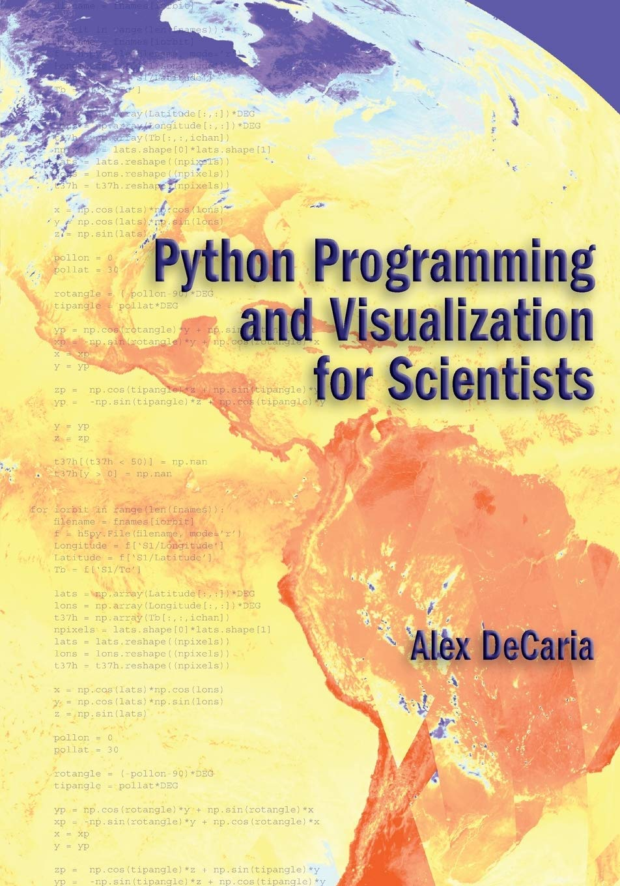
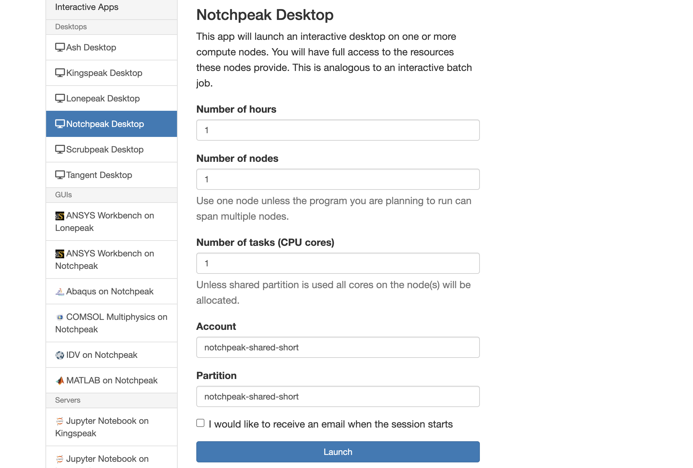
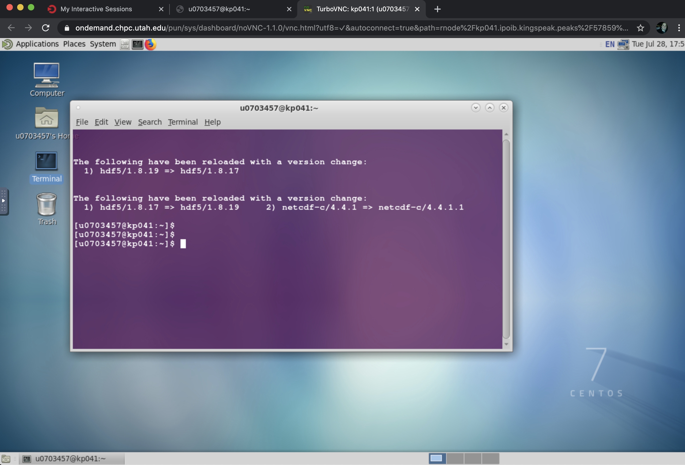
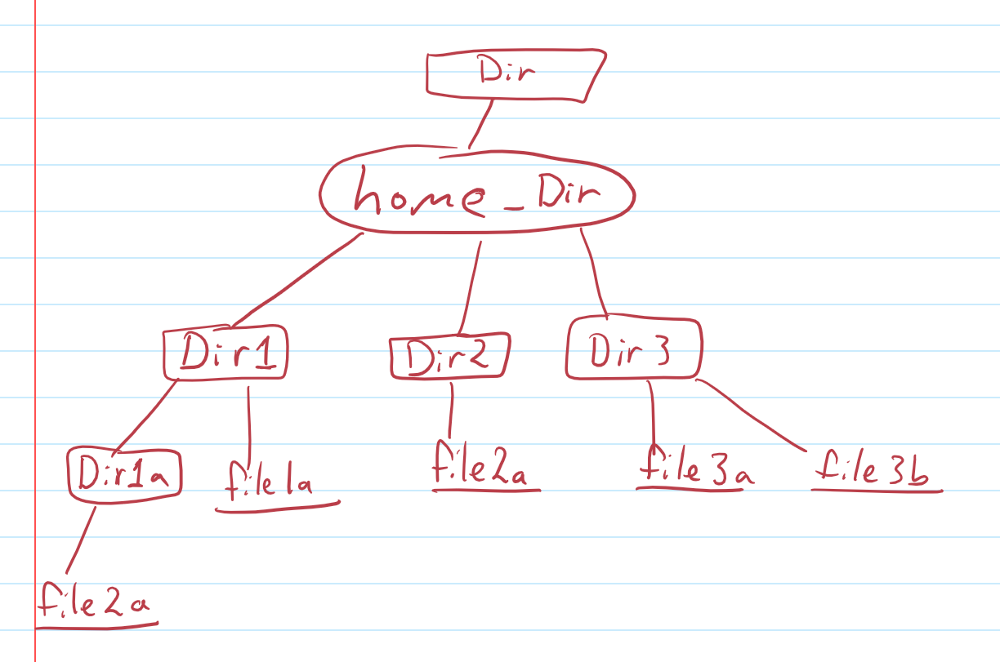

**Module 0** 
**ATMOS 5340: Environmental Programming and Statistics**  
**John Horel and Derek Mallia** 
Orginally developed by Brian Baylock 

# Welcome to ATMOS 5340: Environmental Programming and Statistics

Canvas: https://utah.instructure.com/courses/626414 
GitHub: https://github.com/tartanrunner25/ATMOS-5340_course/ 

> # Today’s Objectives
> 1. Review nuts and bolts of the class (see syllabus)
>     - Canvas: https://utah.instructure.com/courses/626414/
> 2. Get familiar with your computer  
> 3. Introduce Linux and basic commands 

|Instructors|Email|Phone|Office Hours|Office Location|
|-|-|-|-|-|
|Derek Mallia| derek.mallia@utah.edu||By appointment|WBB 713|
|John Horel|john.horel@utah.edu|Office: (801) 581-7091 Cell: (801) 870-9450|By appointment|INSCC 483|

Emails sent to us to arrange for an appointment or to discuss a class-related topic should include ATMOS 5340 in the subject line.  **Or send it via Teams!**

# Text Books
- **Required**: _Python Programming and Visualization for Scientists_. A. DeCaria.
    - https://sundogpublishingstore.myshopify.com/products/python-programming-and-visualization-for-scientists-alex-j-decaria
- **Recommended**: _A Hands-On Introduction to Using Python in the Atmospheric and Oceanic Sciences_.
    - Chapters can be downloaded for free from  http://www.johnny-lin.com/pyintro/

# Course Description
**Prerequisite: MATH 1210**

This is a short course in computer programming. Why should you learn how to program? To make your lives easier through automation and complex calculations.

> ❎ Who has done any sort of programming before?

Learning to program is similar to learning a spoken language:
- It is hard to do.
- It is easier for some people than others.
- It is difficult to learn how on your own by just reading a book.
- It requires practice. _Lots of practice_.
- It is a potential lifelong skill that could make you _more employable_!

> 🎹 Learning to code is very similar to taking piano lessons. With more practice you will develop "muscle memory." Likewise, you will get rusty if you don't practice.

Environmental scientists need the ability to acquire and process environmental data, and communicate results efficiently. In this class, we will
- Focus on programming fundamentals and selected applications of scientific computer programming relevant to environmental fields.
- Stress skills necessary to solve physically-based problems using computational resources and methods.
- Focus on the linux computing environment using the open source Python language. Programming concepts independent of language syntax are stressed.

## At the end of the course you will be able to:
1. Become familiar with the Linux computing environment.
1. Perform basic scientific calculations relevant to environmental fields using Python. 
1. Use best practices to design, write, and debug computer programs. 
1. Develop confidence to modify example codes to obtain new capabilities for the underlying code (i.e., progress onward from cookbook-style programming).
1. Employ techniques to access, process, and visualize environmental data sets on Linux computers.

## How to succeed in this class
1. Review the notes and **repeat** the class exercises.
2. Review the links to info provided in the assignments and in the notes.
3. Organize the info in ways that help you access it quickly:
    - On your phone using an app?
    - Writing it down on a piece of paper, egads?
    - Writing it on a file accessible via Ubox?
    - Ask your classmates questions using Teams

## Format
- Online Class sessions will held twice a week and will encompass a combination of lectures and interactive programming
    - Brief lectures.
    - Follow along with the instructor and answer quick questions.
    - _Short Break_
    - Independent lab work. You will be given a considerable time to complete assignments, especially towards the end of the semester. Take advantage of this time. 
- Much of the instructional material related to programming will be online as markdown files (like in this document). Statistical notes will be prvided as PDFs and PowerPoint slides. 
- You must complete and turn in assignments and quizzes by the assigned due date. There is no credit for late work without approval in advance to do so.

### Assignments and quizzes
Assignments and quizes on Canvas are tied to the lectures.

## Grading

> **Plagiarizing, copying, or otherwise misrepresenting ones' work will not be tolerated.**

- 40% Statistical assignments and quizes
- 60% Programming assignments and quizes

|      |                       |
|------|-----------------------|
|90% + | guarantees an A or A- |
|80% + | guarantees a B+, B, or B- |
|70% + | guarantees a C+, C, or C- |
|60% + | guarantees a D+, D, or D- |
|below 60%| may result in an E |

_Cutoff points for the specific grades are identified to define reasonable distribution of grades._

# Communication is key!

You can send questions using Canvas or email, BUT a better way may be to use _Teams_! **The benefit of using Teams is that you can communicate and collaborate with your classmates in an organized way.** This will be a useful tool when you get stuck on assignments. 

Aside from homework help, learning how to use Teams is a useful skill because you will very likely use collaboration tools in a future job.

As part of the first assignment, you are to send me a couple messages using Teams. You will also answer poll questions using Teams today.
- _Teams_ is installed on the classroom computers.
- Download the Teams app to your phone, computer, or just use it from a browser.

## [Click here to join our Teams workspace](https://teams.microsoft.com/l/team/19%3a0e0b5e28bbd14883a0c075df95b94c05%40thread.skype/conversations?groupId=822f4682-c35b-4daa-a42a-12d72c857a0b&tenantId=5217e0e7-539d-4563-b1bf-7c6dcf074f91)

> **NOTE:** You must to use your campus UNID, not another Microsoft account, to log into teams.   
>- Username/email is `uXXXXXXX@umail.utah.edu`.  
>- Password is you CIS password you use for everything on campus.

Lets explore the _Teams_ application and become familiar with it.

---
---
  

# Introduction to Computers

## Computing Hardware is Ever Changing

- Phones, tablets
- Laptops, desktops
- Shared computing resources provided by University (Center for High Performance Computing)
- Cloud computing: Amazon, Google, Microsoft
- [_Frontier_: The world's fastest computer is being built right now](https://www.theverge.com/2019/5/7/18535078/worlds-fastest-exascale-supercomputer-frontier-amd-cray-doe-oak-ridge-national-laboratory)

## Computing Environment Is Ever Changing

- Enter code
- Cards
- Text terminals
- Graphical User Interface (GUI)

## Many Languages
- Assembly
- Cobol, Basic
- Fortran, C, C++
- Python, R, Julia, Go

> Read: https://www.techrepublic.com/article/julia-whats-next-for-pythons-fast-growing-programming-language-rival/
  

## Increasing Connectedness of Computers
  https://www.isc.org/network/survey/ 

## The nuts and bolts

Modern computers have:
- 2-4 “cores” or central processing units (cpus).
- Each cpu has ram (most used) and cache (fastest access) memory.
- Some storage medium/disk.
- “Peripherals” are that: peripheral

> **Question❓**  
>What hardware does your computer have? How much RAM does it have? What type of processor? **Click the Apple menu at the top left and select "About this Mac."**

# What is UNIX?
UNIX is a command line operating system developed in late 1960s at Bell Labs.
- Multi-tasking and multi-user operating system
- Originally written using C
- Unix is designed so that users can extend the functionality:
  - To build new tools easily and efficiently
  - To customize the shell and user interface.
  - To string together a series of Unix commands to create new functionality.
  - To create custom commands that do exactly what we want.

### Features of Unix Systems
1. Simple design, organization, and functioning
2. Portability
3. Background processing
4. Hierarchical File System
5. Multi-user
6. Multi-tasking
7. Security
8. Interactive Operating System
9. Communication facilities
10. Utilities

Around 1990, Linus Torvalds of Helsinki University developed an open source/academic version of Unix known as **Linux**. (Some history: https://www.linux.com/news/linus-torvalds-reflects-25-years-linux).

# Shell

The “Shell” is simply the layer on top of the operating system that provides a basic human-OS interface.

- It is a command interpreter. To make the computer do something, you type commands and press enter to execute  commands.
- It is built on top of the operating system kernel. (Be thankful for the Shell, else using a computer by interacting with the kernel would be impossible).
- The shell enables users to run services provided by the UNIX OS.
- In its simplest form, a series of commands in a file is a shell program that saves having to retype commands to perform common tasks.

  
---
---

# Lets access a linux computer...

The Center for High-Performance Computing ([CHPC](https://www.chpc.utah.edu/)) offers many resources not available on these classroom computers. This section will show you how to access CHPC resources. Today you will create a new directory accessible on the CHPC web server.

## Log onto a CHPC computer: `notchpeak`

 To access the Notchpeak server goto the following webpage:

    https://ondemand.chpc.utah.edu

  
 To access CHPC's OnDemand service, you will need to provide your uID and password.
  
 Next, goto the *'Interactive Apps'* link at the top of the OnDemand web portal, and select *Notchpeak Desktop*
  
❗❗**NOTE:** CHPC's Open OnDemand service works best on Firefox or Google Chrome web browsers. *Does NOT work with Safari* 
  

  
This will open up a form that will allow the user (you!) to access a linux terminal on Notchpeak. For now, leave **number of hours** and **number of nodes** at their default values of 1. 
  
For **account** and **partition**, CHPC has graciously provided the class with free access to Notchpeak. For this class, just leave **account** and **partition** at their default values. This should be `notchpeak-shared-short`
  
Hit launch at the bottom of the webpage.
  
This will then open up a linux web portal that you access by clicking on 'Launch Notchpeak Desktop'. 
  
You just logged onto a different computer located at the University's Downtown Data Center. This is a Linux system. 

  
**If** you want to access CHPC directly from your computer, there are alternative ways to do this. **However, this is not required!**

> ## 🤚 "I want to access CHPC using more traditional means (i.e MacOS terminal)!" Follow the instructions above and follow this YouTube tutorial, _Logging Onto CHPC resources_: https://www.youtube.com/watch?v=hP2GDWCTKg4

> ## 🤚 **How do I log onto CHPC resources on my Windows PC?** [Use Putty and Xming](./supplemental_docs/putty.md).

  
---
---

Open a `terminal`:

> ### 👍 Pro Tip! When using a command line, imagine your computer doesn't have a mouse. All input is typed. Believe it or not, there was a time when mouses where not mainstream (pre-1985)

Type the following command

     echo $SHELL
  
Let us know if it says something besides `/bin/bash`.
  	
When done with the terminal, type `exit`.

❗❗ **ALWAYS EXIT** terminal windows and **LOG OUT** of your computer when you are done. ❗❗

# Unix File System
The Unix file system is the structure in which all the information on your computer is stored.
- It has hierarchical file structure, where each directory can contain files, as well as other directories.
- It looks like an upside down tree.
- Unix looks at everything as a file.
  - At the top of the tree is the root directory, represented by a forward slash, `/`.
  - Then, there are a set of common directories such as `/bin`, `/dev`, `/home`, etc.

> ▶ Watch this video for more info on how the file system is organized. Some of it will be over your head, but you will pick up a few things of how the Linux file system is organized: https://youtu.be/HbgzrKJvDRw 

Some key differences between Windows and Unix file systems.

|Windows|Linux|
|--|--|
|file system drive letters represent different storage devices, like `C:` is a hard disk, etc.|All storage devices are in the same file system hierarchy.|
|Uses backslash `\` to separate directory names| Uses forward slash `/` to separate directory names|
||Every file and directory in a Linux system has permissions and ownership associated with it.
|File names have suffixes (like .png, .txt, etc.) | suffixes are not required, but used by convention|

In Unix systems, the chunk of the disk is divided into blocks (1024-bytes block, or 4096-bytes block, etc.) in multiples of 512 bytes in size.

These blocks are organized into four groupings: boot block, superblock, inode blocks, and data blocks.

    

# Try this! Navigating directories
The first thing to do in the terminal is to find out where you are on the server. Type:

    pwd

`pwd` stands for "print working directory". 

By default, this is your “home” directory on this specific computer.

Now try:

    ls

`ls` stands for "list contents". This command shows you the subdirectories created in your home directory.

    cd Desktop
    pwd

> ## Question: Where are you now?
> Answer the poll question in Teams:
>  - Desktop
>  - Home directory
>  - No clue? Help!!

Now type 

    cd ..

> ## Question: Where are you now?
> Answer the poll question in Teams:
>  - Desktop
>  - Home directory
>  - No clue? Help!!

`cd` means "change directory." The `..` after `cd` moves you back a directory. 

Try it again `cd ..`. Now where are you?

Now type just `cd`. Where are you now? (check with `pwd`)

  
# Try this! Creating a file

    ls
<!---->
    ls  > subdirs.txt
<!---->
    ls 

What is in the directory now?

    more subdirs.txt 
    
What do you see?

    cp subdirs.txt Desktop/

`cp` means "copy". You copy a file to a new path location. What’s now on your Desktop screen?

Double click the new file. What do you see? _Answer in Teams_.

> ### 👍 Pro Tip! When typing long file names, you can hit the tab button to "auto complete". This might help you type faster. For example instead of typing the full file name `subdirs.txt` you could type `subdi` and then hit the tab button. If the file exists, the tab button auto completes the file name. 

  
# Try this! File system commands
Become familiar with these Linux commands

|Unix Command|What it does|
|--|--|
|`pwd`|Where you are now on the file system?
|`cd` |Return to your home directory
|`df -m`|What disks are on the system and the amount of space available in kilobytes
|`who`|  The command shows who is logged on
|`finger [unid]`|   Who is UNID
|`date`|     Prints the system date and time
|`cal`| Prints a calendar
|`man`|      Formats and displays on-line manual pages. Type `q` to exit.
|`history`|  List prior commands
|``!!``|     Previous command
|``!##``|  Repeat prior command number XXX

  
# Try this! List contents of directories
    
    ls [-options]

### Option Description
|`ls` Command Options|What it does|
|--|--|
|`ls -l`| 	list in long format
|`ls -C`|	multicolumn output
|`ls -F`|	indicates type of file by `/`, `*`
|`ls -r`|   List files in reverse order
|`ls -R`|	recursive listing of all subdirectories	encountered
|`ls -a`| 	list all files including hidden files
|`ls -t`|    sort by time modified
|`ls -lt`|  You can combine options. This lists files in long format by time.

  
# Try this! Change Directories
`cd` Changes the working directory to the directory if specified or to the home directory otherwise

    cd [directory name]  
### Option Description
|`cd` Command Usage|What it does|
|--|--|
|`cd ..`| Go up/back one directory
|`cd dirname/`| Change to dirname directory relative to the location you are currently in

  
# Try this! Making a new directory

    cd ~

Where are you?

    cd Desktop
    mkdir temp
    
What’s now on your Desktop?

    cd temp
    ls
    
Are there any files in that directory now?

  
# Lets grab a file...

In your linux terminal cd into the temp directory you just create, and run the following command: 

    wget http://home.chpc.utah.edu/~u0703457/dereks_homepage/Atmos_5340/textbook.jpg

Check to see if the file was saved within your temp directory using linux terminal.

Does it appear in the temp folder on your desktop?

  
# Lab Time (not graded):
On a piece of paper, draw your computer's directory tree. 

Use the `cd` and `ls` command to map our your directory structure. Use `pwd` to print your current directory to see where you are at.

> How do you know if an item is a file or a directory? Type `ls -l` to list the "long details". If the left most letter is `d` it is a directory, if it is `-`, then it is a file (we will talk about the other letters another day).

### Directions:
- Circle your "home" directory (i.e., where you end up when you just do a `cd`)
- Square all directory names
- Underline any files.

  
# _**Practice, Practice, Practice**_
After today, you should be able to:
1. Open the terminal on the Mac and type commands.
1. List the current path and files contained in the path.
1. Comfortably navigate to different directories.
1. Send (write) output to a file instead of printing it to the screen.
1. Copying a file to a different path. (Can you copy the image in the `temp` directory to the `Desktop`?)

> ## Really want to get started with Linux?
> For more practice, try one or more of these online tutorials:  
>> **👉🏼 WATCH THIS!!! [CHPC Introduction to Linux](https://www.youtube.com/watch?v=0EYrzOKtuBg)** (It's part of a future assignment).
>
> - https://www.javatpoint.com/linux-tutorial
> - https://ryanstutorials.net/linuxtutorial/
> - https://www.tutorialspoint.com/unix/
> - http://www.ee.surrey.ac.uk/Teaching/Unix/
> - https://www.guru99.com/introduction-linux.html
> - https://linuxsurvival.com/linux-tutorial-introduction/
> - ⭐ CHPC lectures: https://www.chpc.utah.edu/presentations/IntroLinux3parts.php 
> - Many other resources (Google around for Linux Tutorials)
>
> ## Linux resources
>Dozens of books and online resources
>- http://www.ee.surrey.ac.uk/Teaching/Unix/
>- http://heather.cs.ucdavis.edu/~matloff/unix.html
>- http://searchdatacenter.techtarget.com/tutorial/77-Linux-commands-and-utilities-youll-actually-use

  

