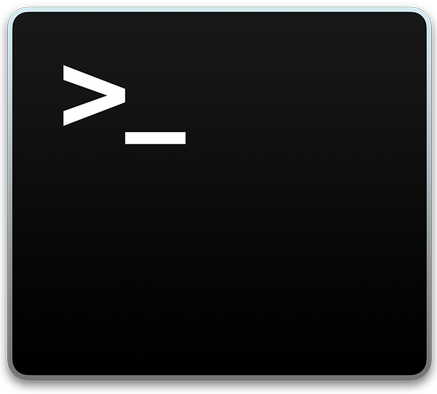

**August 24-28, 2020**   
**ATMOS 5340: Environmental Programming and Statistics**  
**John Horel and Derek Mallia** 
Orginally developed by Brian Baylock 

# Welcome to ATMOS 5340: Environmental Programming and Statistics

Canvas: https://utah.instructure.com/courses/626414 
GitHub: https://github.com/tartanrunner25/ATMOS-5340_course/ 

> # Today’s Objectives
> 1. Review nuts and bolts of the class (see syllabus)
>     - Canvas: https://utah.instructure.com/courses/626414/
> 2. Get familiar with your computer  
>       1. Log onto the 711 Macs 
>       1. Set-up and use Teams
>       1. Install Anaconda-Python and VSCode
> 1. Introduce Linux and basic commands on the Mac

|Instructors|Email|Phone|Office Hours|Office Location|
|-|-|-|-|-|
|Derek Mallia| derek.mallia@utah.edu||By appointment|WBB 713|
|John Horel|john.horel@utah.edu|Office: (801) 581-7091 Cell: (801) 870-9450|By appointment|INSCC 483|

Emails sent to us to arrange for an appointment or to discuss a class-related topic should include ATMOS 5340 in the subject line.  **Or send it via Teams!**

 
 
❗❗❗❗❗❗❗❗❗❗❗❗❗**Important**❗❗❗❗❗❗❗❗❗❗❗❗❗❗  
**Due to restrictions related to COVID, this class, which normally is taught in a computer lab is now being  
moved online and will utilize CHPC's Open OnDemand service. This can be accessed via google chrome/firefox web browsers.  
For now, disregard the computer lab specific instructions.**  
❗❗❗❗❗❗❗❗❗❗❗❗❗❗❗❗❗❗❗❗❗❗❗❗❗❗❗❗❗❗❗❗❗
 
 
 

**You will sit at the same computer all semester** (so choose wisely).  

Your **username** and **password** are the ones you use for Canvas, CIS, umail, etc.

> ❎ Who is familiar with a Mac and who is familiar with a PC?

Poke around; you won’t break anything!
- At the bottom pannel, click on the left most icon: `Finder`
- Look under `Applications` --> `Utilities` 
- Find and open `Terminal` or `XQuartz`
- Dock or un-dock unnecessary programs.

**Be aware that other classes are taught in this room and you won't always have access to your computer.** It might be helpful to bring a flash drive to keep files you want to continue working on when your computer isn't available. Or, use `Ubox` (box.utah.edu) to upload and later retrieve your course content.
> If you don't have access to this room, talk to Nola Lucke in the department office on the 8th floor.

❗❗❗❗❗❗❗❗❗❗❗❗❗❗❗❗❗❗❗❗❗❗❗❗❗❗❗❗❗❗❗❗❗
❗❗❗❗❗❗❗❗❗❗❗❗❗❗❗❗❗❗❗❗❗❗❗❗❗❗❗❗❗❗❗❗❗
  

# Text Books
- **Required**: _Python Programming and Visualization for Scientists_. A. DeCaria.
    - https://sundogpublishingstore.myshopify.com/products/python-programming-and-visualization-for-scientists-alex-j-decaria
- **Recommended**: _A Hands-On Introduction to Using Python in the Atmospheric and Oceanic Sciences_.
    - Chapters can be downloaded for free from  http://www.johnny-lin.com/pyintro/

# Course Description
**Prerequisite: MATH 1210**

This is a short course in computer programming. Why should you learn how to program? To make your lives easier through automation and complex calculations.

> ❎ Who has done any sort of programming before?

Learning to program is similar to learning a spoken language:
- It is hard to do.
- It is easier for some people than others.
- It is difficult to learn how on your own by just reading a book.
- It requires practice. _Lots of practice_.
- It is a potential lifelong skill that could make you _more employable_!

> 🎹 Learning to code is very similar to taking piano lessons. With more practice you will develop "muscle memory." Likewise, you will get rusty if you don't practice.

Environmental scientists need the ability to acquire and process environmental data, and communicate results efficiently. In this class, we will
- Focus on programming fundamentals and selected applications of scientific computer programming relevant to environmental fields.
- Stress skills necessary to solve physically-based problems using computational resources and methods.
- Focus on the linux computing environment using the open source Python language. Programming concepts independent of language syntax are stressed.

## At the end of the course you will be able to:
1. Become familiar with the Linux computing environment.
1. Perform basic scientific calculations relevant to environmental fields using Python. 
1. Use best practices to design, write, and debug computer programs. 
1. Develop confidence to modify example codes to obtain new capabilities for the underlying code (i.e., progress onward from cookbook-style programming).
1. Employ techniques to access, process, and visualize environmental data sets on Linux computers.

## How to succeed in this class
1. Review the notes and **repeat** the class exercises.
2. Review the links to info provided in the assignments and in the notes.
3. Organize the info in ways that help you access it quickly:
    - On your phone using an app?
    - Writing it down on a piece of paper, egads?
    - Writing it on a file accessible via Ubox?
    - Ask your classmates questions using Teams

## Format
- Class sessions will be held in 711 WBB that allows for a mix of instructional styles.
    - Brief lectures.
    - Follow along with the instructor and answer quick questions.
    - _Short Break_
    - Independent lab work. You are being given considerable time in the lab to complete assignments. Take advantage of this time. The lab is scheduled for you until 5:00 PM.
- Much of the instructional material will be online as markdown files (like this document) on GitHub or as PDFs of PowerPoint slides. 
- You must complete and turn in assignments and quizzes by the assigned due date. There is no credit for late work without approval in advance to do so.

### "Check Your Understanding" quizzes
"Check Your Understanding" assignments on Canvas are tied to the lectures. You should retake the _Check Your Understanding_ quizzes until you get the answers right.

### Assignments
You should have time to complete assignments during class. If you need more time, you should take advantage of computers in other labs on campus.

## Grading

> **Plagiarizing, copying, or otherwise misrepresenting ones' work will not be tolerated.**

- 30% Class participation and _Check Your Understanding_ quizzes
- 70% Assignments

|      |                       |
|------|-----------------------|
|90% + | guarantees an A or A- |
|80% + | guarantees a B+, B, or B- |
|70% + | guarantees a C+, C, or C- |
|60% + | guarantees a D+, D, or D- |
|below 60%| may result in an E |

_Cutoff points for the specific grades are identified to define reasonable distribution of grades._

# Communication is key!

You can send questions using Canvas or email, BUT a better way may be to use _Teams_! **The benefit of using Teams is that you can communicate and collaborate with your classmates in an organized way.** This will be a useful tool when you get stuck on assignments. 

Aside from homework help, learning how to use Teams is a useful skill because you will very likely use collaboration tools in a future job.

As part of the first assignment, you are to send me a couple messages using Teams. You will also answer poll questions using Teams today.
- _Teams_ is installed on the classroom computers.
- Download the Teams app to your phone, computer, or just use it from a browser.

## [Click here to join our Teams workspace](https://teams.microsoft.com/l/team/19%3a0e0b5e28bbd14883a0c075df95b94c05%40thread.skype/conversations?groupId=822f4682-c35b-4daa-a42a-12d72c857a0b&tenantId=5217e0e7-539d-4563-b1bf-7c6dcf074f91)

> **NOTE:** You must to use your campus UNID, not another Microsoft account, to log into teams.   
>- Username/email is `uXXXXXXX@umail.utah.edu`.  
>- Password is you CIS password you use for everything on campus.

On your own time, explore the _Teams_ application and become familiar with it.

  

# Install Python and VSCode
Later in this class, we will learn how to program with Python. The lab computers already have Python built in as part of the OS.  

❗Due to the ongoing COVID pandemic, access to the lab computers will be limit/non-existant this semester. As a result, we will be utilizing online resources from the University of Utah's Center for High Performance Computing (CHPC). Through this service, you will be able to access pyton and linux terminals from your web browser. You also have the option to access CHPC servers using your laptop. *You can also install python on your personal laptop or PC, however, our support may be limited if you have issues installing python and its libraries.* 

**The following instructions apply if you want to use a Mac to install python**
>## Default Python on Mac OS
>Open a terminal and type `which python` and hit enter.  This is the directory path to the built-in Python interpreter.
>
>Now type `python`, hit enter, and you will be inside the Python interpreter. You know you are in Python because of the `>>>` ahead of the curser. This is where you can type Python commands. We will do more in Python a different day.
>
>What version of Python is this? It says it is `Python 2.7`. This is the machine's default version, but it is an old version and you can't add-on packages because you don't have admin privileges on the machine. Thus, we need to install an updated version.
> Exit out of Python by typing `exit()`. Then exit out of the terminal.

 

## Download and install Python on the Mac computer.
Python is free software. The easiest way to install Python on your computer is to download it from a distribution service, like Anaconda. It takes a lot of space, but it is worth it.

1. Go to https://www.anaconda.com/ and click the Download button at the top.
1. We want to download **Python 3.7**. _Make sure you download the macOS installer_.
1. Open the installer and go through the steps by clicking `Continue`.
1. BEFORE CLICKING `INSTALL`...click `Click Install Location` and select "Install for me only."
1. Now you can install.
    - These computers are fast. It shouldn't take more than a few minutes to install.
1. After installation, open a terminal window again and type the following and see how things changed:
    - `which python` (it should be the python installed under your uNID directory)
    - `python` (it should say the version is python 3.7)

> You can also install Anaconda-Python on your personal computer. [Refer to these instructions](https://github.com/johnhorel/ATMOS_5020_2019/blob/master/supplemental_docs/install_anaconda_windows.md) if are using a Windows PC and are unsure what to do. You might want to do this if you work on assignments outside of the classroom.

## Anaconda Launcher
After the installation completes, find and open the Anaconda Launcher, and pin it to the dock. Anaconda Launcher is a GUI that will help you manage software packages and we will add more another day.

## Install VSCode
VSCode is a powerful text editor that we need for class. There are many other text editor options, but VSCode is a very good one that is offered through Anaconda. Click the `Install` button. When it is installed, find it and pin it to the dock. We will use this in later classes to write and edit scripts. If you are able to install Python on your personal computer, this is a great tool for editing scripts. I use this editor for all my programming!

_We will return to using Python another day. Thanks for your patience._

---
---
   

# Introduction to Computers

## Computing Hardware is Ever Changing

- Phones, tablets
- Laptops, desktops
- Shared computing resources provided by University (Center for High Performance Computing)
- Cloud computing: Amazon, Google, Microsoft
- [_Frontier_: The world's fastest computer is being built right now](https://www.theverge.com/2019/5/7/18535078/worlds-fastest-exascale-supercomputer-frontier-amd-cray-doe-oak-ridge-national-laboratory)

## Computing Environment Is Ever Changing

- Enter code
- Cards
- Text terminals
- Graphical User Interface (GUI)

## Many Languages
- Assembly
- Cobol, Basic
- Fortran, C, C++
- Python, R, Julia, Go

> Read: https://www.techrepublic.com/article/julia-whats-next-for-pythons-fast-growing-programming-language-rival/
  

## Increasing Connectedness of Computers
  https://www.isc.org/network/survey/ 

## The nuts and bolts

Modern computers have:
- 2-4 “cores” or central processing units (cpus).
- Each cpu has ram (most used) and cache (fastest access) memory.
- Some storage medium/disk.
- “Peripherals” are that: peripheral

> **Question❓**  
>What hardware does your Mac have? How much RAM does it have? What type of processor? **Click the Apple menu at the top left and select "About this Mac."**

# What is UNIX?
UNIX is a command line operating system developed in late 1960s at Bell Labs.
- Multi-tasking and multi-user operating system
- Originally written using C
- Unix is designed so that users can extend the functionality:
  - To build new tools easily and efficiently
  - To customize the shell and user interface.
  - To string together a series of Unix commands to create new functionality.
  - To create custom commands that do exactly what we want.

### Features of Unix Systems
1. Simple design, organization, and functioning
2. Portability
3. Background processing
4. Hierarchical File System
5. Multi-user
6. Multi-tasking
7. Security
8. Interactive Operating System
9. Communication facilities
10. Utilities

Around 1990, Linus Torvalds of Helsinki University developed an open source/academic version of Unix known as **Linux**. (Some history: https://www.linux.com/news/linus-torvalds-reflects-25-years-linux).

 
## Mac OS X is a variant of Linux
- Other variants: Ubuntu, Red Hat, and CentOS
- Mac OS X has a "desktop environment” to provide a graphical user interface to application programs and system settings
- You can use the basic features of linux on a Mac using the terminal, XQuartz, Atom application programs

# Shell

The “Shell” is simply the layer on top of the operating system that provides a basic human-OS interface.

- It is a command interpreter. To make the computer do something, you type commands and press enter to execute  commands.
- It is built on top of the operating system kernel. (Be thankful for the Shell, else using a computer by interacting with the kernel would be impossible).
- The shell enables users to run services provided by the UNIX OS.
- In its simplest form, a series of commands in a file is a shell program that saves having to retype commands to perform common tasks.

# Linux on Mac

The **Command Line Interface (CLI)** is how you interact with the linux shell on your Mac.

  
**Do not have access to a Mac?** No problem! CHPC's Open OnDemand service will allow you to access a linux terminal straight from your computer's web browser!

Open an x-term window using `terminal` or `XQuartz`.

> ### 👍 Pro Tip! When using a CLI, imagine your computer doesn't have a mouse. All input is typed.

Type the following command

     echo $SHELL
  
Let us know if it says something besides `/bin/bash`.
  	
When done with the terminal, type `exit`.

❗❗ **ALWAYS EXIT** terminal windows and **LOG OUT** of your computer when you are done. ❗❗

# Unix File System
The Unix file system is the structure in which all the information on your computer is stored.
- It has hierarchical file structure, where each directory can contain files, as well as other directories.
- It looks like an upside down tree.
- Unix looks at everything as a file.
  - At the top of the tree is the root directory, represented by a forward slash, `/`.
  - Then, there are a set of common directories such as `/bin`, `/dev`, `/home`, etc.

> ▶ Watch this video for more info on how the file system is organized. Some of it will be over your head, but you will pick up a few things of how the Linux file system is organized: https://youtu.be/HbgzrKJvDRw 

Some key differences between Windows and Unix file systems.

|Windows|Linux|
|--|--|
|file system drive letters represent different storage devices, like `C:` is a hard disk, etc.|All storage devices are in the same file system hierarchy.|
|Uses backslash `\` to separate directory names| Uses forward slash `/` to separate directory names|
||Every file and directory in a Linux system has permissions and ownership associated with it.
|File names have suffixes (like .png, .txt, etc.) | suffixes are not required, but used by convention|

In Unix systems, the chunk of the disk is divided into blocks (1024-bytes block, or 4096-bytes block, etc.) in multiples of 512 bytes in size.

These blocks are organized into four groupings: boot block, superblock, inode blocks, and data blocks.

    

# Try this! Navigating directories
The first thing to do in the terminal is to find out where you are on your computer. Type:

    pwd

`pwd` stands for "print working directory". Since you are on a local disk on this Mac, each local disk is separate from the others.

By default, this is your “home” directory on this specific computer.

Now try:

    ls

`ls` stands for "list contents". This command shows you the subdirectories created in your home directory.

    cd Desktop
    pwd

> ## Question: Where are you now?
> Answer the poll question in Teams:
>  - Desktop
>  - Home directory
>  - No clue? Help!!

Now type 

    cd ..

> ## Question: Where are you now?
> Answer the poll question in Teams:
>  - Desktop
>  - Home directory
>  - No clue? Help!!

`cd` means "change directory." The `..` after `cd` moves you back a directory. 

Try it again `cd ..`. Now where are you?

Now type just `cd`. Where are you now? (check with `pwd`)

  
# Try this! Creating a file

    ls
<!---->
    ls  > subdirs.txt
<!---->
    ls 

What is in the directory now?

    more subdirs.txt 
    
What do you see?

    cp subdirs.txt Desktop/

`cp` means "copy". You copy a file to a new path location. What’s now on your Desktop screen?

Double click the new file. What do you see? _Answer in Teams_.

> ### 👍 Pro Tip! When typing long file names, you can hit the tab button to "auto complete". This might help you type faster. For example instead of typing the full file name `subdirs.txt` you could type `subdi` and then hit the tab button. If the file exists, the tab button auto completes the file name. 

  
# Try this! File system commands
Become familiar with these Linux commands

|Unix Command|What it does|
|--|--|
|`pwd`|Where you are now on the file system?
|`cd` |Return to your home directory
|`df -m`|What disks are on the system and the amount of space available in kilobytes
|`who`|  The command shows who is logged on
|`finger [unid]`|   Who is UNID
|`date`|     Prints the system date and time
|`cal`| Prints a calendar
|`man`|      Formats and displays on-line manual pages. Type `q` to exit.
|`history`|  List prior commands
|``!!``|     Previous command
|``!##``|  Repeat prior command number XXX

  
# Try this! List contents of directories
    
    ls [-options]

### Option Description
|`ls` Command Options|What it does|
|--|--|
|`ls -l`| 	list in long format
|`ls -C`|	multicolumn output
|`ls -F`|	indicates type of file by `/`, `*`
|`ls -r`|   List files in reverse order
|`ls -R`|	recursive listing of all subdirectories	encountered
|`ls -a`| 	list all files including hidden files
|`ls -t`|    sort by time modified
|`ls -lt`|  You can combine options. This lists files in long format by time.

  
# Try this! Change Directories
`cd` Changes the working directory to the directory if specified or to the home directory otherwise

    cd [directory name]  
### Option Description
|`cd` Command Usage|What it does|
|--|--|
|`cd ..`| Go up/back one directory
|`cd dirname/`| Change to dirname directory relative to the location you are currently in

  
# Try this! Making a new directory

    cd

Where are you?

    cd Desktop
    mkdir temp
    
What’s now on your Desktop?

    cd temp
    ls
    
Are there any files in that directory now?

  
# Doing some science
In your browser, click on the following link:
https://mesowest.utah.edu/cgi-bin/droman/time_chart_dyn.cgi?stn=WBB&unit=0&past=0&month1=&day1=00&year1=&hour1=00&time=LOCAL&hours=24&var=TMPF&gsize=0.85&level=All

Right click on the image as “Save Image As” to the temp directory you just created.

In the terminal, find the image you just saved and look at the file properties:

    ls –ltr

  
# Lab Time (not graded):
On a piece of paper, draw your computer's directory tree. 

Use the `cd` and `ls` command to map our your directory structure. Use `pwd` to print your current directory to see where you are at.

> How do you know if an item is a file or a directory? Type `ls -l` to list the "long details". If the left most letter is `d` it is a directory, if it is `-`, then it is a file (we will talk about the other letters another day).

### Directions:
- Circle your "home" directory (i.e., where you end up when you just do a `cd`)
- Square all directory names
- Underline any files.

  
# _**Practice, Practice, Practice**_
After today, you should be able to:
1. Open the terminal on the Mac and type commands.
1. List the current path and files contained in the path.
1. Comfortably navigate to different directories.
1. Send (write) output to a file instead of printing it to the screen.
1. Copying a file to a different path. (Can you copy the image in the `temp` directory to the `Desktop`?)

> ## Really want to get started with Linux?
> For more practice, try one or more of these online tutorials:  
>> **👉🏼 WATCH THIS!!! [CHPC Introduction to Linux](https://www.youtube.com/watch?v=0EYrzOKtuBg)** (It's part of a future assignment).
>
> - https://www.javatpoint.com/linux-tutorial
> - https://ryanstutorials.net/linuxtutorial/
> - https://www.tutorialspoint.com/unix/
> - http://www.ee.surrey.ac.uk/Teaching/Unix/
> - https://www.guru99.com/introduction-linux.html
> - https://linuxsurvival.com/linux-tutorial-introduction/
> - ⭐ CHPC lectures: https://www.chpc.utah.edu/presentations/IntroLinux3parts.php 
> - Many other resources (Google around for Linux Tutorials)
>
> ## Linux resources
>Dozens of books and online resources
>- http://www.ee.surrey.ac.uk/Teaching/Unix/
>- http://heather.cs.ucdavis.edu/~matloff/unix.html
>- http://searchdatacenter.techtarget.com/tutorial/77-Linux-commands-and-utilities-youll-actually-use

  

