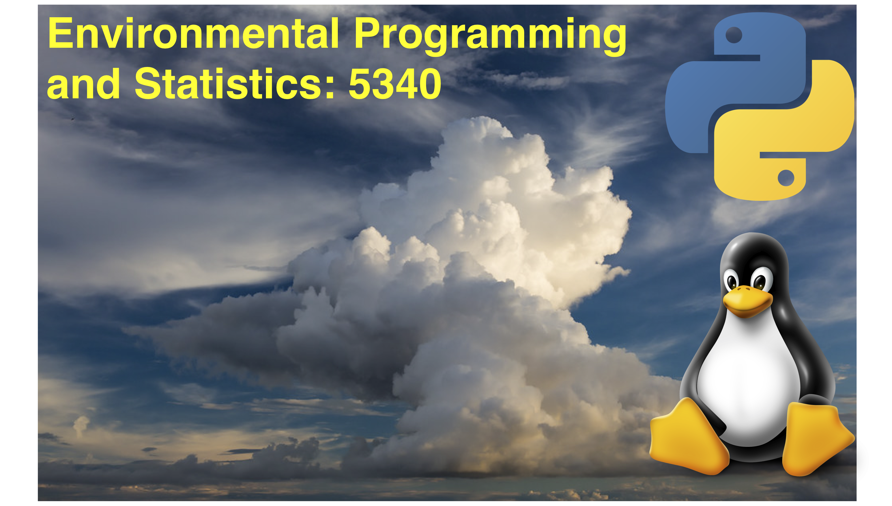

**Week of October 12th, 2020**   
**ATMOS 5340: Environmental Programming and Statistics** 
**John Horel and Derek Mallia** 
 

> # Announcement: 
> Your 5th programming assignment on Panda, Numpy Arrays, and plotting is **due in two weeks.**

> # Today's Objective
> Introduce Python's Pandas library
> Discuss why we would want to use Pandas
> Use Pandas to manipulate some basic data sets
  

#  Python Pandas

Pandas is a data manipulation tool built on Python's Numpy
- stufffff 
- more stuff
- and even more stuff....

**Before starting:** Make sure that you open up a Jupyter notebook session using OnDemand so you can interactively follow along with today's lecture! If you have forgotten how to do this, refer to the previous lecture and class notes.

    
  
---
---
    

> # Want more practice!? 
> Check out the following webpages: 
> https://pandas.pydata.org/pandas-docs/version/0.15/tutorials.html 
> https://www.youtube.com/watch?v=dcqPhpY7tWk&t=113s 

