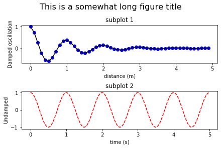

**Module 8** 
**ATMOS 5340: Environmental Programming and Statistics** 
**John Horel and Derek Mallia** 
 

> # Announcement: 
> Your 5th programming assignment on Panda, Numpy Arrays, and plotting is **due this Sunday.**

> # Today's Objective
> Introduction to plotting with Python using the Matplotlib library
> Create simple 1-D plots
> Adjust plotting elemements
> Plot data from a Pandas Dateframe
> Review other types of plots
  

#  Plotting

Reading in and manipulating data is great, however, visualizing this data in some shape or form is often the end result for most programs! In this lecture we will learn how to plot up that data and edit different plotting elements to make our plots more visually appealing.
- We learn how to make a simple 1-D line plot
- Adjust different elements in our line plot 
- Plot data from the dateframe that we were working with last week.
- Visualize data in other ways such as histograms, pie charts, and scatter plots.

**Before starting:** Make sure that you open up a Jupyter notebook session using OnDemand so you can interactively follow along with today's lecture!

  
---
---

#  Basic plotting

Before we can start plotting data, we must import the matplotlib plotting library, which contains classes and functions for creatig MATLAB-style plots and graphs. We will primarily be working with the `pyplot` submodule for today's lecture. In addition, lets go ahead and import NumPy and Pandas, since we will be utilizing functions from those modules as well.

    import matplotlib.pyplot as plt
    import numpy as np
    import pandas as pd
    

Lets create a dummy data set to initially work with before we start working with 'real' data. Using NumPy, create the following 1-D array:

    x = np.arange(0,100.5,0.5)
    y = 2.0*np.sqrt(x) 
    plt.plot(x,y)
    plt.show()

What happened? Were you able to generate the plot below?

Once you call the function pyplot.show() is called, which can be shorthanded as `plt.show()`, no more changes can be made to our plot or its axes.

  
A matplotlib plot generally consists of a `figure` object and an `axes` object. In the example above, these were automatically generated for us using the `plt.plot()` function. However, if we want to have more control of our plot, such as adding muliple axes, we will want to have more control over our plotting routines. Here, we will want to store our plot as a figure object by setting setting plt.figure() to a variable:

    fig = plt.figure()
    
Once a figure has been created, axes objected can be created and placed on our figure using `add_axes()` method for the figure object. Anyways more on this later, as this is used for slightly more advanced plots, which we are not quite ready for yet!

  

To change the color of our line plot, we can simply note a color when executing the plt.plot() function. For example, what if we wanted a *red* line:

    plt.plot(x,y,'red')
    plt.show()
    
Did you get a red line?

  

We can also plot multiple lines/markers on a single plot just by calling the plt.plot() function multiple times before showing the figure.

    # evenly sampled time at 200ms intervals
    t = np.arange(0., 5., 0.2)

    plt.plot(t, t, color="red", linestyle = "--",linewidth=2) 
    plt.plot(t, t**2, color="blue", marker = "o",linewidth=0)
    plt.plot(t, t**3, color="green", marker = "^",linewidth=0)
    plt.plot(t, t**(5/2), color="orange", linestyle = "-",linewidth=5/2)
    plt.show()

I really nice quick guide on Python line and marker options can be found [here](https://towardsdatascience.com/all-your-matplotlib-questions-answered-420dd95cb4ff). 

Also, the figure below may be useful as it identifies plotting elements and the terminology used to name them. This could be helpful, especially when googling questions: 

  

To add labels to our figure we can use the `plt.xlabel()`, `plt.ylabel()`, and  `plt.title()` functions:

    t = np.arange(0., 5., 0.2)

    plt.plot(t, t, color="red", linestyle = "--",linewidth=2) 
    plt.plot(t, t**2, color="blue", marker = "o",linewidth=0)
    plt.plot(t, t**3, color="green", marker = "^",linewidth=0)
    plt.plot(t, t**(5/2), color="orange", linestyle = "-",linewidth=5/2)
    plt.xlabel('Time [seconds]')
    plt.ylabel('Velocity [m/s]')
    plt.show()

  
If labels are added to each plot element, we can use this to create a legend.

    t = np.arange(0., 5., 0.2)

    plt.plot(t, t, color="red", linestyle = "--",linewidth=2,label="Blimp") 
    plt.plot(t, t**2, color="blue", marker = "o",linewidth=0,label="Propeller plane")
    plt.plot(t, t**3, color="green", marker = "^",linewidth=0,label="737")
    plt.plot(t, t**(5/2), color="orange", linestyle = "-",linewidth=5/2,label="Airbus")
    plt.xlabel('Time [seconds]')
    plt.ylabel('Velocity [m/s]')
    plt.title('Aircraft velocities')
    plt.legend(loc="upper left")
    plt.show()

  

Lets say we wanted to zoom in on the lower velocity values. How would we do this? Fortunately, maplotlib has a function for explicitly setting the y `ylim` and x `xlim` axis limits:

    t = np.arange(0., 5., 0.2)

    plt.plot(t, t, color="red", linestyle = "--",linewidth=2,label="Blimp") 
    plt.plot(t, t**2, color="blue", marker = "o",linewidth=0,label="Propeller plane")
    plt.plot(t, t**3, color="green", marker = "^",linewidth=0,label="737")
    plt.plot(t, t**(5/2), color="orange", linestyle = "-",linewidth=5/2,label="Airbus")
    plt.xlabel('Time [seconds]')
    plt.ylabel('Velocity [m/s]')
    plt.title('Aircraft velocities')
    plt.legend(loc="upper left")
    plt.ylim(0,20)
    plt.show()

  

Python's matplotlib library as has the ability to create multi-panel plots when the programmer utlizies the the `plt.subplot()` function. The first two arguments, `nrows`, `ncols`, defines the number of panels. These are usually inputed as integers. In the code snipit below, we tell matplotlib that we want 2 rows and 1 column, so a 'vertical' 2 panel plot. This function returns a figure and axes object. If you check the length of each of these objects using the `len()` function, unsuprisingly, they have a length = 2, since we wanted *two* panels as given by our arguements for the `plt.subplot()` function.

    def f(t):
        return np.exp(-t) * np.cos(2*np.pi*t)

    t1 = np.arange(0.0, 5.0, 0.1)
    t2 = np.arange(0.0, 5.0, 0.02)

    fig, axs = plt.subplots(2, 1, constrained_layout=True)
    axs[0].plot(t1, f(t1),color="blue", marker = "o",linewidth=0)
    axs[0].plot(t1, f(t1),color="black", linestyle = "-")
    axs[0].set_title('subplot 1')
    axs[0].set_xlabel('distance (m)')
    axs[0].set_ylabel('Damped oscillation')
    fig.suptitle('This is a somewhat long figure title', fontsize=16)

    axs[1].plot(t2, np.cos(2*np.pi*t2),color='red',linestyle = "--")
    axs[1].set_xlabel('time (s)')
    axs[1].set_title('subplot 2')
    axs[1].set_ylabel('Undamped')
    plt.show()
    

  
---
---

#  Lets plot up some real data!

Now that we can make some basic 1-D plots, lets play around with some real data now! From our last lecture, you may recall that we read in some meteorological data for WBB into a dataframe and played around with some of this data using Pandas. Now that we know how to plot data, lets go back and plot up some of our meteorological data!

    #Read in our csv file and convert the time object into a datetime64[ns] object
    dat = pd.read_csv('lecture7_WBB.csv',sep=',',skiprows=6)
    dat['Date_Time'] = pd.to_datetime(dat.Date_Time)
    
    #Decompose wind into u- and v-components incase we do any sort of time averaging...
    u = -1*dat['wind_speed_set_1']*np.sin(dat['wind_direction_set_1']*(np.pi/180))
    v = -1*dat['wind_speed_set_1']*np.cos(dat['wind_direction_set_1']*(np.pi/180))
    
    dat['u_wind'] = u
    dat['v_wind'] = v
    
  
Great! Lets print out 'dat' and make sure that everything looks ok. If so, lets try to plot up something from this data set. First, lets plot up temperature as thats a fairly "basic" variable. Before we do this, lets import the following libraries from pandas, which will allow matplotlib to play nice with pandas....

    from pandas.plotting import register_matplotlib_converters
    register_matplotlib_converters()

    plt.plot(dat['air_temp_set_1'], color="red", linestyle = "-",linewidth=2,label="Temp [F]")
    plt.show()
    

    
  
Does anything show up?
While this looks like *something* it probably would be helpful to plot this up with some times. Pandas dateframe structures sync up easily with matplotlib so objects like `datetime64[ns]` can easily be intrepreted by matplotlib. 

At the same time, lets also make the plot bigger using the `plt.figure()` and the argument for figure size `figsize`. Here, `figsize` has inputs of width and height (inces). We'll set as 10 and 8 inches. 
  
    plt.figure(figsize=(10,8))
    plt.plot(dat['Date_Time'],dat['air_temp_set_1'], color="red", linestyle = "-",linewidth=2,label="Temp [F]")
    plt.xticks(rotation=45)
    plt.xlabel('Time [MST]')
    plt.ylabel('Temp. [F]')
    plt.show()
    

    
  
Better.... Those tick values and axis labels are kinda small, lets see if we can adjust these...

    plt.figure(figsize=(10,8))
    plt.plot(dat['Date_Time'],dat['air_temp_set_1'], color="red", linestyle = "-",linewidth=2,label="Temp [F]")
    plt.xticks(rotation=45,fontsize=14)
    plt.yticks(fontsize=14)
    plt.xlabel('Time [MST]',fontsize=18)
    plt.ylabel('Temp. [F]',fontsize=18)
    plt.title('WBB air temperature',fontsize=22)
    plt.show()

  
Ok, thats a reasonable quality figure.... Ok, lets look at something different! How about wind speed and gust?

    plt.figure(figsize=(10,8))
    plt.plot(dat['Date_Time'],dat['wind_speed_set_1'], color="purple", linestyle = "-",linewidth=2,label="Wind")
    plt.plot(dat['Date_Time'],dat['wind_gust_set_1'], color="darkgreen", marker="x",linewidth=0,label="Wind Gust")
    plt.xticks(rotation=45,fontsize=14)
    plt.yticks(fontsize=14)
    plt.xlabel('Time [MST]',fontsize=18)
    plt.ylabel('Wind speed [mph]',fontsize=18) 
    plt.title('WBB wind')
    plt.legend(loc="upper left")
    plt.show()

  
That is *windy*! Where were these strong winds coming from? Lets plot up some wind directions. Preferably on the same plot. However, if we plot this up on our wind speed axis, it would likely stretch the y axis limit to 360 degrees, which is not ideal. We need to plot this on the same figure, but on a different axis... How do we do this?

    fig, ax1 = plt.subplots(figsize=(15,8))

    ax1.plot(dat['Date_Time'],dat['wind_speed_set_1'], color="purple", linestyle = "-",linewidth=2,label="Wind")
    ax1.plot(dat['Date_Time'],dat['wind_gust_set_1'], color="darkgreen", marker="x",linewidth=0,label="Wind Gust")
    ax1.tick_params(axis='x',rotation=45,labelsize=16)
    ax1.tick_params(axis='y',labelsize=16)
    ax1.set_xlabel('Time [MST]',fontsize=20)
    ax1.set_ylabel('Wind speed [mph]',fontsize=20) 
    ax1.set_title('WBB wind',fontsize=22)
    ax1.legend(loc="upper left",fontsize=16)
    ax2 = ax1.twinx()

    ax2.plot(dat['Date_Time'],dat['wind_direction_set_1'], color="blue", marker=".",linewidth=0,label="Wind Direction")
    ax2.set_ylabel('Wind direction [mph]',fontsize=20,color="blue")
    ax2.tick_params(axis='y', labelcolor="blue",labelsize=16)
    ax2.legend(loc="upper right",fontsize=16)

    #Overlays legends on points
    ax1.set_zorder(1) # make it on top
    ax1.set_frame_on(False) # make it transparent
    ax2.set_frame_on(True) #
    plt.show()

  

Looks like the stongest winds are associated with winds coming out of ~50-90 degrees, or NE-east. These measurements were taken during the 2011 downslope wind storm, which was quite the event!

  
---
---

#  Other types of plots

In addition to doing timeseries, matplotlib library also has the ability to make other types of plots such as histograms, pie charts, scatter plots and so on. Lets look at a few quick examples...
  
**Histograms:** Lets use our wind data and check out the distribution of winds during our downslope wind storm:

    plt.figure(figsize=(6,6))
    plt.hist(dat['wind_gust_set_1'],bins=20,edgecolor='black', linewidth=1,color='purple')
    plt.xticks(fontsize=12)
    plt.yticks(fontsize=12)
    plt.xlabel('Wind speed [mph]',fontsize=14)
    plt.ylabel('Frequency [#]',fontsize=14)
    plt.title('Histogram of wind gusts',fontsize=18)

  
    
**Scatterplots:** What is the relationship between wind speeds and gusts? Do we see higher wind gusts when the wind is stronger? 

    plt.figure(figsize=(6,6))
    plt.scatter(dat['wind_speed_set_1'],dat['wind_gust_set_1'], marker='o')
    plt.xticks(fontsize=12)
    plt.yticks(fontsize=12)
    plt.xlabel('Mean wind [mph]',fontsize=14)
    plt.ylabel('Wind gusts [mph]',fontsize=14)
    plt.xlim(0,np.max([dat['wind_gust_set_1'],dat['wind_speed_set_1']]))
    plt.ylim(0,np.max([dat['wind_gust_set_1'],dat['wind_speed_set_1']]))

  

**Categorial plots:** You may also want to create a plot that uses categorical variables in Matplotlib...

    #Create a dictionary of items we want to plot
    data = {'apples': 10, 'oranges': 15, 'lemons': 5, 'limes': 20}
    names = list(data.keys())
    values = list(data.values())
    
    plt.bar(names, values,color="red",edgecolor='black',linewidth=1)
    plt.xticks(fontsize=14)
    plt.yticks(fontsize=14)

  

**Box and whisker plots:**

    # Fixing random state for reproducibility
    np.random.seed(19680801)

    # fake up some data
    spread = np.random.rand(50) * 100
    center = np.ones(25) * 50
    flier_high = np.random.rand(10) * 100 + 100
    flier_low = np.random.rand(10) * -100
    data = np.concatenate((spread, center, flier_high, flier_low))

    fig1, ax1 = plt.subplots()
    ax1.set_title('Basic Plot')
    ax1.boxplot(data)

  
**Contour plots:** Finally, matplotlib can also plot maps and contour maps. More on this next week....!

  
---
---

> # Want more practice!? 
> Check out the following webpages: 
> https://www.johnny-lin.com/pyintro/ed01/free_pdfs/ch09.pdf 
> https://www.tutorialspoint.com/numpy/numpy_matplotlib.htm 
> https://matplotlib.org/tutorials/introductory/pyplot.html 
> https://pandas.pydata.org/pandas-docs/stable/user_guide/visualization.html 
> https://towardsdatascience.com/all-your-matplotlib-questions-answered-420dd95cb4ff 
> https://matplotlib.org/3.3.0/api/markers_api.html 

