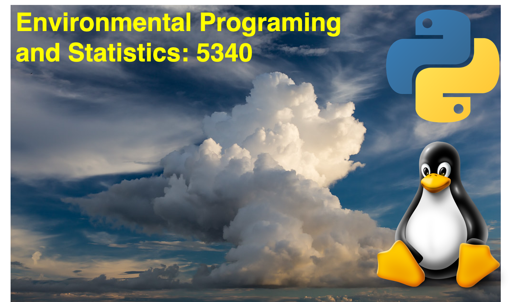

**Module 6** 
**ATMOS 5340: Environmental Programming and Statistics** 
**John Horel and Derek Mallia** 
 

> # Announcement: 
> Your 4th programming assignement on Module 5 is **due this Sunday.**

> # Today's Objective 
> Getting familar with NumPy arrays 
> Manipulating and rehaping NumPy arrays 
> Go over other useful commands related to NumPy arrays 
  

#  Python NumPy Arrays
## Chapter 6 from the Alex DeCaria textbook: 'NumPy Arrays'

The Numpy module, which is readily installed with my Python distributions, is designed to work with large data sets, particularly those with multiple dimensions. However, unlike Python lists and tuples, NumPy arrays cannot hold multiple data types. For example, a defined numpy array must be all floating numbers, strings, integers, ect....  Despite this rule, it is much more computationally efficient to work with NumPy arrays than with lists/tuples. For this lecture, we will learn how to: 
- Create arrays
- Review common NumPy data types
- Go over useful array functions
- Discuss array indexing and subsetting
- Learn how to reshape arrays
- Combine logical operators with arrays

**Note:** There are *ALOT* of things you can do with NumPy arrays, so for the purpose of time, we will not be abe to go over every function/trick related to NumPy arrays. *It will be up to you* to read the DeCaria book and review other online resources! This lecture is meant to give you the tools so that you can work with basic NumPy arrays.

**Before starting:** Make sure that you open up a Jupyter notebook session using OnDemand so you can interactively follow along with today's lecture! 

  
---
---

# Creating an array

**Opening files:** There are many ways one can create an array using NumPy. The most simple way to this is supply NumPy's array function and give it a list/tuple as its input. Before starting, you must load the NumPy module:

    import numpy as np
    
then, we can create a 1D array by doing the following:
    
    a = np.array([1,5,3,-6,-2,4,-9,2,2])
        
The array that we created will be all integers, since we only supplied it with integer values. 

    type(a)
    >> <class 'numpy.ndarray'>
    
    type(a[0])
    >> <class 'numpy.int64'>

However, we can also create an array and predefine the data type using the `dtype` agrument:

    a = np.array([1,5,3,-6,-2,4,-9,2,2],dtype=np.float64)
    
    type(a[0])
    >> <class 'numpy.float64'>
    
Here, you can see that the first element in array a is now a floating number.

  
Listed below are the data typs most commonly used within NumPy arrays:

>- `np.float`: Double percision (64 bit) floating point
>- `np.int64`: Double percision (64 bit) integer
>- `np.complex128`: Complex number, with a real and imaginary part that are each 64 bits
>- `np.bool_`: Boolean (True/False) data type. Note the underscore `_`. 

  

You can also create 2-D arrays (or other multidimensional arrays) by inserting nested lists/tuples as the input for `np.array` function...

    a = np.array([[2,5],[1,-4]])
    
    print(a)
    >> array([[ 2,  5],
              [ 1, -4]])

Finally, you can also create arrays using single values:

    a_zero = np.zeros((10,10))
    
    print(a_zero)
    
    >> array([[0., 0., 0., 0., 0., 0., 0., 0., 0., 0.],
    >>        [0., 0., 0., 0., 0., 0., 0., 0., 0., 0.],
    ....
    >>        [0., 0., 0., 0., 0., 0., 0., 0., 0., 0.],
    >>        [0., 0., 0., 0., 0., 0., 0., 0., 0., 0.]])

or

    a_nan = np.empty((10,10))
    a_nan[:] = np.nan 
    
    print(a_nan)
    
    >> array([[nan, nan, nan, nan, nan, nan, nan, nan, nan, nan],
              [nan, nan, nan, nan, nan, nan, nan, nan, nan, nan],
              ...
              [nan, nan, nan, nan, nan, nan, nan, nan, nan, nan],
              [nan, nan, nan, nan, nan, nan, nan, nan, nan, nan]])

Personally, I like using NaN arrays when I want to fill in the data later on...

  
---
---

# Sequential arrays

There are 3 functions that are primarily used to generate sequential arrays in Python. These functions are `arange()`, `linspace()`, and `logspace()`. The `arange()` function behaves very similarly to the `range()` function in Python:

    seq_array = np.arange(0,11,2)
    
    print(seq_array)
    >> [ 0  2  4  6  8 10]
    
    seq_array = np.arange(11,0,-2)
    
    print(seq_array)
    >> [11  9  7  5  3  1]
    
And you get the idea... The data type of the array is determined by the input. So if all the inputs are integers, it will be an integer-type data array. Note that you can define the dtype argument when using the `np.arange` function.

  

The `linspace()` function allows the user to specify a begining and end value and the number of points to create:

    seq_array = np.linspace(1,10,30)
    
    print(seq_array)
    >> array([ 1.        ,  1.31034483,  1.62068966,  1.93103448,  2.24137931,
    >>         2.55172414,  2.86206897,  3.17241379,  3.48275862,  3.79310345,
    ...
               7.20689655,  7.51724138,  7.82758621,  8.13793103,  8.44827586,
    >>         8.75862069,  9.06896552,  9.37931034,  9.68965517, 10.        ])

  

Finally, the `np.logspace()` function works similar to the `linspace()` function, but here, the values are spaced logarithmically. See the DeCaria text for more example on this!

  
---
---

# Indexing and subsetting arrays

Specific elements in an array can be accessed by indexing or subsetting Python NumPy arrays, similar to that of lists/tuples. For multidimensional arrays, the different dimensions are seperated by commas. The first index often refers to the row of the array, while the second index refers to the column. For 3 dimensional arrays, the 3rd index would represent the height, and so on...

⚠️ Note: *Technically*, subsetting an array and saving it to a variable does not create a new copy of it, essentially it is just a pointer to the original array. This ultimately saves memory for the computer, which can be important when working with large data sets. This does not change anything for the purposes of this class, more or less this is just good to know. This is referred to as a *shallow* copy. If you must copy an array, you can use the `np.copy()` function, but this is rarely needed. 

Here are some example on how to index arrays wich is similar to indexing tuples/lists. In the most part should be review... ;-)

    seq_array = np.arange(0,11,2)
    
    print(seq_array)
    >> array([ 0,  2,  4,  6,  8, 10])
    
    print(seq_array[3])
    >> 6
    
    print(seq_array[3:])
    >> [ 6  8 10]
    
    print(seq_array[-1])
    >> [10]
    
  

And some striding examples...

    seq_array = np.arange(0,21,1)
    
    print(seq_array)
    >> array([ 0,  1,  2,  3,  4,  5,  6,  7,  8,  9, 10, 11, 12, 13, 14, 15, 16,17, 18, 19, 20])
    
    
    print(seq_array[0:12:2])
    >> array([ 0,  2,  4,  6,  8, 10])
    
    
    print(seq_array[::-1])
    >> [20 19 18 17 16 15 14 13 12 11 10  9  8  7  6  5  4  3  2  1  0]
    
    
    print(seq_array[::-2])
    >> [20 18 16 14 12 10  8  6  4  2  0]
    
    
And you get the idea...!

  

Finally, it is also possible to index with lists, which can be very useful:

    my_list = [0,2,4,6,8,10]
    
    print(seq_array[my_list])
    >> array([ 0,  2,  4,  6,  8, 10])

This is useful, especially when utilizing the `where()` function. More on this later!

  

Indexing multidimensional arrays is very similar to that of 1-D arrays, except that there are 2 or more dimensions that you need to consider. For example, lets say I wanted to grab the first element of a 2D array (upper left corner or the '1'):

    array_2D = np.array([[1,2,3],[4,5,6],[7,8,9]])
    
    print(array_2D) 
    >> array([[1, 2, 3],
              [4, 5, 6],
              [7, 8, 9]])
              
    print(array_2D[0,0])
    >> 1

What if I want to grab the top middle index (the '2')?

    print(array_2D[0,1])
    >> 2
    
What is I wanted to grab the entire middle row (4, 5, 6)?

    print(array_2D[1,:])
    >> [4 5 6]
    

What if I wanted to subset for the numbers 5, 6, 7, 8?

    print(array_2D[1:3,1:3])
    >> array([[5, 6],
              [8, 9]])

Is there another way we can index this? There is more than one solution!

  

And what if we wanted to grab the left middle value of our array (the '4')? *You tell me the answer!*

  

  
---
---

# Broadcasting arrays

After defining an array, we can use a technique referred to as *broadcasting* to perform mathematical expressions or other Python functions. Think of this as if you are telling Python to broadcast a command to an audience, with this audience being all of the elements within your array. Some examples:
    
    print(array_2D)
    >> array([[1, 2, 3],
             [4, 5, 6],
             [7, 8, 9]])
    
    print(array_2D * 2)
    >> array([[ 2  4  6]
              [ 8 10 12]
              [14 16 18]])
              
    
 This works with other mathematical functions like addition, division, substraction, ect....
 
   
 
 You can also broadcast to specific elements within an array as well...
    
    print(array_2D[1:,1:] + 10)
    >> [[15 16]
    >>  [18 19]]
    
    print(array_2D[:2,:2]**2)
    >> [[1  4]
    >>  [16 25]]
    

  

Arrays can also be added and subtracted together...

    array1 = np.array([[1,2,3],[4,5,6],[7,8,9]])
    array2 = np.array([[1,2,3],[4,5,6],[7,8,9]])
    
    array3 = array1 + array2
    
    print(array3)
    >> array([[ 2,  4,  6],
              [ 8, 10, 12],
              [14, 16, 18]])
              
 
  
---
--- 
    
# Explicit and implicit loops

For more complicated expressions, especially those that require multiple lines of code, we can use the `for` loop construct to go through elements in our array. Generally, this is less efficient, and so it should only be used when absolutely necessary.

⚠️ Note: If Python is your first programming language, you may find yourself using loops more often that not until you start mastering programming. As time goes on you will become a more proficient programmer, but this does not happen overnight so be patient!

An example of an explicit loop:

    x = np.linspace(0,4*np.pi,100) 
    y = np.zeros_like(x)
    
    for i, val in enumerate(x):
        y[i] =  np.sin(val)
        

Of course we can also simplify the above code by doing the following...

    x = np.linspace(0,4*np.pi,100) 
    y = np.sin(x)

  
---
--- 

# Other useful array-related commands

Listed below are useful functions and methods that I use when working with arrays!

>- `<var name>.sum()`: Computes the sum of an array
>- `<var name>.mean()`: Computes the mean of an array
>- `<var name>.std()`: Computes the standard deviation of an array
>- `<var name>.var()`: Computes the variance of an array
>- `<var name>.var()`: Computes the variance of an array
>- `shape()`: Returns the shape of an array
>- `size()`: Returns the number of elements in an array

  
---
--- 

# Reshaping, transposing, and shifting arrays

There are also a number of functions available for manipulating and changing the shape of an array, or for moving elements around within an array. 

>- `<var name>.flatten()`: Flattens a multidimensional array to a 1-D version
>- `reshape(a,ns)`: Returns a copy of an array (a) with new shape ns. ⚠️ The new shape must have the same number of elements!
>- `roll(a, shift,axis)`: Moves elements of a by the amount of shift. For multidimensional arrays, the arguments axis must be provided,, which specifies the axis to roll. For 1D arrays this can be left out.
>- `transpose(a)`: returns a transposed copy of a.
>- `rot90(a,n)`: returns a copy of 'a'  rotated clockwise by n x 90 degree. A negative 'n' will rotate 'a' counterclockwise
>- `squeeze(a)`: Returns a copy of 'a' with a single-element dimensions removed (i.e a 0 x 10 array will just be 10). 

Create some arrays and play around with some of these functions and methods!

  
**Appending:** Elements can also be appended to arrays. For example:

    seq_array = np.arange(0,11,2)
    
    print(seq_array)
    >> array([ 0,  2,  4,  6,  8, 10])
    
    seq_array = np.append(seq_array,[12,14])
    print(seq_array)
    >> [ 0  2  4  6  8 10 12 14]

  
**Inserting:** Elements can also be inserted into an array using the `np.insert()` function. This function has arguments 'a', which is our array we are inserting into, 'ind', which is the index of 'a' that we are inserting into. 'Elements' is the last argument, which will be the elements that we will be inserting into array 'a':

    print(seq_array)
    >> [ 0  2  4  6  8 10 12 14]
    
    seq_array = np.insert(seq_array,2,[24,22,20])
    
    print(seq_array)
    >> [ 0  2 24 22 20  4  6  8 10 12 14]
    
  
**Deleting:** Elements can be deleted from an array. The `np.delete()` function, which has arguments 'a' and 'index', can remove elements from 'a' from the specified indices. 

    seq_array = np.delete(seq_array,[2,3,4])
    
    print(seq_array)
    >> array([ 0,  2,  4,  6,  8, 10, 12, 14])
    

  

Elements within an array can also be reassigned following the syntax below:

    seq_array = np.arange(0,11,2)
    
    print(seq_array)
    >> array([ 0,  2,  4,  6,  8, 10])
    
    
    seq_array[3] = 99
    
    print(seq_array)
    >> array([ 0,  2,  4, 99,  8, 10])
    
    
    seq_array[2:5] = [-999,-999,-999]
    
    print(seq_array)
    >> array([   0,    2, -999, -999, -999,   10])
    
    
  
---
--- 
    

# Stacking and splitting arrays

NumPy arrays can also be combined to form a new, multidimensional array or they can be splitted into multiple 'subarrays'.

**Stacking:** Multiple arrays can be stacked horizontally (by column) or vertically (by row) to form a single array. This can be done using the `np.vstack()` or `np.hstack()` functions. An example of a `np.vstack` function can be seen below:

    array1 = np.array([1,2,3])
    array2 = np.array([4,5,6])
    array3 = np.array([7,8,9])
    
    array_2D = np.vstack((array1,array2,array3))
    
    print(array_2D)
    >> [[1 2 3]
        [4 5 6]
        [7 8 9]]

  
**Splitting:**  Arrays can also be seperated into subarrays using the `np.split()`, `np.hsplit()`, & `np.vsplit()` functions. Each of these has arguments for the array we are splitting 'a' and the number of subarrays we want to split our main array into. A `np.vsplit()` example can be seen below:

    array_2D = np.vsplit(array_2D,3)
    
    arrays = np.vsplit(array_2D,3)
    
    print(arrays)
    >> [array([[1, 2, 3]]), array([[4, 5, 6]]), array([[7, 8, 9]])]

  
**Merging:** Finally, two 1-D arrays can be merged together to form a single, multidimensional array using the `np.meshgrid(array1,array2)` function that has arguments of array1 (first array) and array2 (second array):

    lon = np.linspace(-119,-110,10)
    lat = np.linspace(41,50,10)
    
    x2d, y2d = np.meshgrid(lon,lat)
    
What happens when we do this?

  

  
---
--- 

# Logical operations with arrays

The `np.where` function provides a way for the programmer to search through an array and determine which elements meet a certain criteria. This function then returns indices of our array where these conditions are met. For example, lets say we have a 3 x 3 array (2D):

    array_2D = np.array([[3,2,0],[4,-4,-10],[-1,4,11]])
    
Using the `np.where` function, lets determine which indices have elements that are less than 0:

    negative_indices = np.where(array_2D < 0)
   
    print(negative_indices)
    >> (array([1, 1, 2]), array([1, 2, 0]))
    
Did this work? Lets check!

    print(array_2D[negative_indices])

  

We can also add multiple conditions using the where statement....

    x = np.arange(-10,10,1)

    idx = np.where((x > -5) & (x < 5))
    
Did this work? Lets check!
    
    print(x[idx])

       

   

> # Want more practice!? 
> Check out the following webpages:   
> https://www.tutorialspoint.com/numpy/index.htm 
> https://www.w3schools.com/python/default.asp (left navigation bar) 
 

