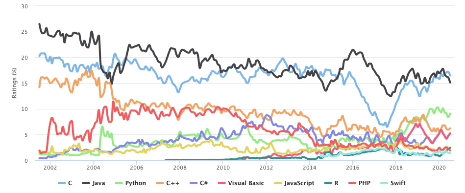
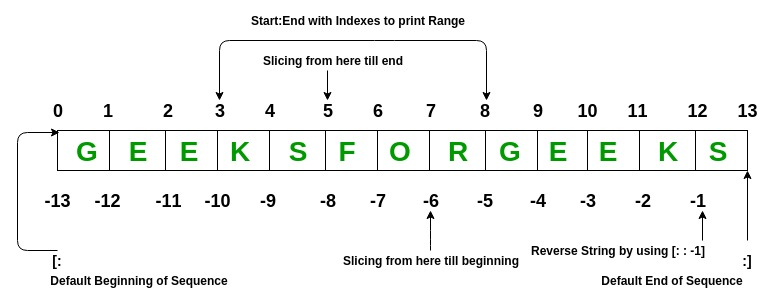

**Module 2** 
**ATMOS 5340: Environmental Programming and Statistics** 
**John Horel and Derek Mallia** 
Originally developed by Brian Baylock 
 

> # Announcement: 
> ## Remember that the 'Check Your Understanding' #2 Quiz is at the end of the week (Sunday).

> # Today's Objective
> Continue to introduce Python and give you the building blocks to do more exciting things later.
>
  

# Introduction to Python
## Chapter 1 from the Alex DeCaria textbook: 'Getting Started'

> ## From _The Zen of Python_, by Tim Peters  
>Beautiful is better than ugly.  
Explicit is better than implicit.  
Simple is better than complex.  
Complex is better than complicated.   
Readability counts.  
>
>>To read the full _Zen of Python_, type `import this` in a Python terminal.

Python is a popular general-purpose computer programming language invented by the Dutch programmer Guido van Rossum in 1990.

Python has grown into one of the top 3 most-popular programming languages, ranked by usage: https://www.tiobe.com/tiobe-index/.

 

It is heavily used by many companies including Google, Dropbox, Netflix, Spotify, Facebook, Goldman Sachs, etc. and, of course, in environmental science. There have been many tweets about Hurricane Dorian today. Many of the graphics appear to be made with Python. 
[Here](https://twitter.com/TropicalTidbits/status/1168162318422859777) |
[Here](https://twitter.com/JohnMoralesNBC6/status/1168242646600617984) |
[Here](https://twitter.com/RMS/status/1168633930930622467) |
[Here](https://twitter.com/mikarantane/status/1168794064675885056) |
[Here](https://twitter.com/JoshuaAlland/status/1168890718280212495) |
  
Some other examples of python maps that I've personally made can be found [here!](http://home.chpc.utah.edu/~u0703457/dereks_homepage/Atmos_5340/figures_made_in_python.pptx)
 
 
With a just a little bit of elbow grease you can make some really terrific plots using python! The plotting options in python are truely limitless.
 
 

## Stepping back for a second, why programming?
Learning a new language sounds really difficult! I am already a Microsoft Excel wiz kid, why can't I just use that for my number crunching?
- Data sets used in the Atmospheric Sciences are often very large
- A simple CSV file with weather station data can easily have millions of lines
- Numerical weather prediction data and other environmental data sets are often provided in compressed file formats not readable by Excel
- Even then, these data sets often contains a hundred million data points or more...
- Its difficult to automate processes with Excel and other spreadsheet applications!
- Ultimately, programming is quicker, *and easier* once you have become proficient with a specific language 
    - Learning your first langage is always the toughest part and learning subsequent languages is generally MUCH easier
- Programming is potentially a lifelong skill that will ultimately make you more employable depending on your career path

## Why use Python?
- Python software is **open source**, meaning that people can freely modify and share it.
- Python **syntax**, or the programing language's "grammar rules", is relatively intuitive compared to other languages. 
- Python Code can be easier to read due to formatting conventions. 
    - e.g., indented code blocks.
- Code is **interpreted** rather than **compiled**.  
    - Interpreted code runs slower, but is easier to write and debug.
- Python is relatively easy to learn. There is abundant documentation and learning material available online.
- More environmental science is being done in Python.
 - Python is object-oriented. Everything is an object. This makes coding very flexible but can also be confusing. We'll tend to use Python in a procedural-programming context that should minimize the confusion.

> ## A good read: [Why your first programming language doesn't really matter](https://www.techrepublic.com/article/why-your-first-programming-language-doesnt-really-matter/)

# Python 2 vs 3
Differences in coding are relatively minor but can create issues.
- Version 2.7 remains heavily used, but support for it is _rapidly_ being deprecated.
    - How much time is left? [Python 2.7 Retirement Count Down](https://pythonclock.org/)
    - Spoiler... Time is up!
- **Version 3.7**, or higher, is what you should be using.

Python 3.7 has already been installed for you! However, if you are feeling adventurous, you could install Python 3 on your own computer!
- For [Mac](https://docs.anaconda.com/anaconda/install/mac-os/) 
- For [PC](https://docs.anaconda.com/anaconda/install/windows/) 

> Note: When searching for online programming help, be aware of the two different versions and look for answers for Python 3.

A few more things about Python
- Python is dynamically typed
    - Variables generally do not need to be declared before using them (i.e real, string, integer)
- Python has a robust built-in set of data types, and users are free to define additional structures.
- Python is **case sensitive**.
    - Pressure, pressure, PRESSURE will be 3 completely different variables!
- Python is object oriented 
    - A programming paradigm based on the concept of "objects", which can contain data, in the form of fields (often known as attributes or properties), and code, in the form of procedures

---
---

# Terminology
You need to become familiar with terms used typically for all programming languages

| Term | Description | Example |
|--|--|--|
|Script|A file that contains one or more lines of Python code. Ends with the file exension `.py`.| `filename.py`
|Code| Program content 
|Package or Module or Library|Something you import that contains a collection of functions and methods that perform useful actions without writing the code yourself.|`import numpy`
|Statement| Instruction to a computer.| A line of code.
|Assignment| A statement that binds an expression (object) to a variable (name)| `=`
|Object| Anything that a variable can be referred to | a number, string, list, array, function, etc.
|Variable| Name of an assigned object. |
|Expression| Combo of numbers, text, variables, and operators that result in a new object when evaluated| `y = mx+b`
|Function| A block of statements used to create a new object
|Argument| A value passed to a function.| For the statement `max([1,9,5])`.  The object inside the `()` is the argument.
|Algorithm| Recipe for how to solve a problem
|Executable| File used to run a programs | `python`, `jupyter lab`
|Verification| Providing evidence that the program works correctly
|Debugging| Locating and correcting errors in a programs

[Reference: Python Glossary](https://docs.python.org/3/glossary.html)
   
# Syntax and data types

**Before starting:** Make sure that you open up a Jupyter notebook session using OnDemand so you can interactively follow along with today's lecture! If you have forgotten how to do this, refer to the previous lecture and class notes.

**Reminder**: Recall, Python is case-sensitive! PRESSURE, pressure, and Pressure are *NOT* the same variables. Similarly, this also applies to functions as well. For example, the function print() will print out the value assigned to a variable, while Print() would result in an error, unless the user defined their own function named 'Print'.

    a = 1
    print(a)
   
    >>1
    
    
    Print(a)
    
    >>Traceback (most recent call last):
    >>File "<stdin>", line 1, in <module>
    >>NameError: name 'Print' is not defined
    
   

**Other notes about the print function:** This is a useful command for print out the values of variables to the command line. This is particularly useful when debugging code!
   

**Function:** A function is a command that allows python (or any other programming) to peform an automated task, which internally consists of a number of Python commands (under the hood). For example, the function np.mean() will compute the mean of values assigned to the function. The assignment of values to a function is referred to as an 'argument'. Users can also define their own arguments if there is a particular, repeatable task that needs to be carried out. A deeper analysis on 'functions' will be presented in **Chapter 8** of the DeCaria text.

    import numpy as np
    values = [1,2,3,4,5]
    mean_val = np.mean(values)
    print(mean_val)
    
    >> 3.0
    
       

**Code blocks and indentations:** While Python is considered a free-form language, and does have structure in that it uses indentations to delineate code blocks. This is useful in that it forces the user to properly indent their code, which generally makes a piece of code much more readable! Even in the absense of this requirement, all programmers should be indenting their code when appropriate as it makes it easier for a user to follow the logic of the code.

An example of this can be seen in the following for loop, which loops through each value between 0 and 5, and performs a command, and prints out a value depending on the index that we are on (0-5):

    for i in range(0,5):
        i = i **2
        print(i)
    
    >> 0
    >> 1
    >> 4
    >> 9
    >> 16
    
All loops in Python require a colon (:), which tells Python that it is about to execute a code block, like in the example above. Note, that while the indentation requirement is nice as it forces users to delineate their code appropriately, it can be difficult to copy-paste this code into the command line as tabs are sometimes not appropriately interpreted by the Python command line. With Jupyter notebook, this is not nearly as problematic. 
   

**Continuation of lines:** Python does not have a line length limit like older programming languages like Fortran 77. However, it is recommended that longer lines are broken up to make the code more readable. To break up long lines of code, a '\' is used to signify that the following line is a continuation:

    x = 'My favorite type of cloud in the sky is a cumulonimbus' 
    >> x 
    >> 'My favorite type of cloud in the sky is a cumulonimbus'
 
 or 
 
    x = 'My favorite type of cloud' \
    'in the sky is a cumulonimbus' 
    >> x 
    >> 'My favorite type of cloud in the sky is a cumulonimbus'
    
There are also several scenerios where a \ is not necessary. For example, comma-seperated elements contained within a paranthesis (), bracket [], or curly brackets {} can be continued on a different line without using a \. For example:
    
    print('hello','my','name','is','derek')
    
    >> hello my name is derek
    

is the same as:

    print('hello','my','name',
    'is','derek')
    
    >> hello my name is derek
    
    
**Comments:** Similar to most programming languages, a hash # is used to tell a code to skip a line. This is often used to make comments in the code that explain what a piece of code does.

    #Get purple air times and format accordingly
    obs_times = list(p_dat.columns[4:len(p_dat.columns)])
    obs_times = pd.to_datetime([datetime.strptime(obs_time, '%m/%d/%y %H:%M') for obs_time in obs_times])
    obs_times = obs_times + np.timedelta64(6,'h')                       #Shift from LST to UTC

    #Read in purple air data, including the lat lon information using pandas read_csv function
    trax_dat = pd.read_csv(trax_file)
    trax_dat = pd.DataFrame(trax_dat)
   

**Assigning variable names:** Letters and numbers can be used when naming a variable. Limitations include:
> Numbers can't be used as the first character when naming a variable 
> Leading underscores are not recommended 
> Avoid using the reserved words as discussed in the **DeCaria text in Section 2.2.2** 
 

Assigning a value to a variable can be accomplished using the assignement operator '='. For example:

    a = 3.14
    
Here a floating-point value of 3.14 has been assigned to a. Characters can also be assigned to variables:

    b = 'hello'
    

**Numeric data types:** There are four numeric types used by Python. These include booleans, integers, floating-points, and complex numbers. Booleans are designated by 'True' or 'False':

    boo = True 
    boo = False
    
Integers is a variable that is an integer and is often used to index Python arrays. 

    a = 3
    
Floating-point values are different from integers in that they are stored as 64 bits or the equivalent of double percision. These variables can be expressed as decimals or using scientific notation:

    a = 4.1
    b = 4.6e9
    c = -7.3e3
    d = 6.5e-3
    
 It is worth noting that it is also possible to convert between numeric data types. For example you can convert a floating number into an integer:
 
     val = 4
     type(val)
     
     >> <class 'int'>
     
     val = float(val)
     print(val)
     >> 4.0
     type(val)
     
     >> <class 'float'>
     
Speaking of data types, the 'type' function can be used to determine the data type as seen above, and not just for numeric data types for that matter.
    

**Attributes and methods:** Python variables/objects may also have attributes assigned to them. For example, a complex number may have an attribute named real, which is the real part of the complex number. The other attribute of a complex number is its imaginary part 'imag':

    complex = 4.5 - 3.2j
    complex.imag
    >> -3.2
    
    complex.real
    >> 4.5
   

**Methods** can also be associated with variables. A method is analogous to function that belongs to a variable/object. We will see more examples of methods later in this course. 
  

**Strings:** Strings are assigned to a variable using single or double quotations. This will be more thoroughly discussed in the next following Chapter and class lecture. 

    my_string = 'hello'
    num_string = '456.3'
    
   

**Lists and tuples:** These variable types are essentially collection of values. The major differences between lists and tuples is that lists are mutable, which means that their contents can be changed after being created. Tuples are immutable, thus cannot be changed after being created. These variables are assigned using square brackets or parentheses. 

    my_list = [4.5,-7.8,'pickle',5,1e7,True]     #List
    my_tupl = (4.5,-7.8,'pickle',5,1e7,True)     #Tuple
    
Lists and tuples can also be indexed to pull out individual elements or values within a list or tuple. 

    my_list[0]
    >> 4.5
    
     my_list[2]
     >> 'pickle'
     
     
     

Note that Python's indexing scheme is 0 based in that 0 represents the first element in a 1-D list/tuple/array. 
Some other tricks with Python indexing: -1 can be used to return the last element in a list/tuple/array.

    my_list[-1]
    >> True
    
In a somewhat longer way, you could also use Python's length command to grab the last element in a list/tuple/array. 

    my_list[len(my_list)-1]
    >> True
    
You can also subset a list/tuple/array by choosing an index range using a colon:

    my_list = [4.5,-7.8,'pickle',5,1e7,True]     #List
    my_list[1:3]                                 #Index range
    >> [-7.8, 'pickle']
    
    my_list[0:-1:2]                              #'Striding' example
    >> [4.5, 'pickle', 10000000.0]

Indexing can also be used to reassign a value within a list:

    my_list[2] = 14
    print(my_list)
    >> [4.5, -7.8, 14, 5, 10000000.0, True]
    
Finally, if you accidently assign an index that is outside of indicies within a array, Python will spit back the following error:

    my_list[10]
    >> Traceback (most recent call last):
    >> File "<stdin>", line 1, in <module>
    >> IndexError: list index out of range

Many more examples and details on subsetting list/tuple/arrays can be reviewed in **Section 2.7** in the DeCaria text.
  
Instead of manually defining a range of numbers, the 'range' function in Python can be used to create a sequence of integers. The arguements for the range function include the starting value, ending value, and the stride: range(start,end,stride)

    my_list = list(range(0,10,2))
    print(my_list)
    >> [0, 2, 4, 6, 8]
    
If no stride is included, the range function defaults to using a stride of 1.

     my_list = list(range(0,10))
     print(my_list)
     >> [0, 1, 2, 3, 4, 5, 6, 7, 8, 9]
     
 **Some useful functions when working with lists...***
 
     > len(my_list)                      #computes length of a list
     > del my_list[i:j]                  #deletes values at the i through j index
     > my_list.append(element)           #adds an element to the end of an existing list
     > my_list.extend(another_list).     #adds values from another list to an existing list
     > my_list.count(target)             #counts instances of target variable in our list
     > my_list.reverse                   #reverse our list
     
     
More useful functions can be found in **Section 2.7** in the DeCaria text.
  

**Dictionaries:** A dictionary is similar to a list with the exception that instead of indexing with integers, a dictionary uses a key number, string, or another object. 

    thisdict = {"brand": "Ford","model": "Mustang","year": 1964}
    
One of the 'keys' in this case is model:

    thisdict["model"]
    >> 'Mustang'
 
 which will retrieve the cars 'model'.
 
Another example: 

> ### Note: The `\` symbol indicates the code continues on the next line.

    my_dictionary = {1:'b', \
                     2: [23,265,12,43], \
                     3: ('this', 'is', 'a', 'tuple')}

    print(my_dictionary.keys())
    print(my_dictionary[1])
<!---->
    another_dictionary = {'name':'Derek', \
                          'school': 'university of utah', \
                          'hours in office': [8, 9, 10, 11, 12, 13, 14, 15]}
    print(another_dictionary.keys())
    print(another_dictionary['name'])
    print(another_dictionary['name'][0])
    # Notice how the key name can include spaces. This is just a string used to index the dictionary.

[Reference: Python Dictionary](https://www.tutorialspoint.com/python3/python_dictionary.htm)

   
---
---

> # Want more practice!
> Try this tutorial...https://www.tutorialspoint.com/python3/index.htm.  
>
> Or try the [Codecademy Python course](https://www.codecademy.com/learn/learn-python). The course for version 2 is free . The version 3 course requires a subscription, but that isn't necessary since python 2 and 3 are so similar. Just be aware of the difference: 
>
> 
>
> Another resource: https://www.datacamp.com/courses/intro-to-python-for-data-science
