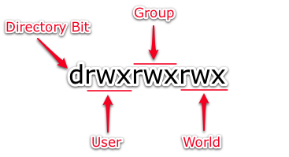

**Module 1**<br>
**ATMOS 5340: Environmental Programming and Statistics**<br>
**John Horel and Derek Mallia**<br>
Originally developed by Brian Baylock<br>


> # Today's Objectives
> 1. Introduce concept of programming languages
> 1. Review basic Linux commands and learn some new ones
> 1. Move files between the classroom Mac and CHPC cluster and access the file on the internet.
> 1. Edit and run short shell scripts.

> # Upcoming Assignments
> 1. Your first programming quiz will be due on **September 6th**, which will be on Module 0-1

<br><br>
# Computer Binary
Computers know only about strings of 0 and 1
- Bits: Binary digITs (two bits: 0 or 1)
- Byte: 8 bits
- 32 or 64 bit words
- Combinations of bytes and words often expressed as hexidecimals (base 16)
- Computers count with bits; humans use base 10
- Computer program is required to translate from/to base 10

## Numbers as bits

|Integer|Bit String|Equation|
|--|--|--|
|0|0|(0 x 2<sup>0</sup>)|
|1|1|(1 x 2<sup>0</sup>)|
|2|10|(1 x 2<sup>1</sup>) + (0 x 2<sup>0</sup>)|
|3|11|(1 x 2<sup>1</sup>) + (1 x 2<sup>0</sup>)|
|4|100|(1 x 2<sup>2</sup>) + (0 x 2<sup>1</sup>) + (0 x 2<sup>0</sup>)|
|5|101|(1 x 2<sup>2</sup>) + (0 x 2<sup>1</sup>) + (1 x 2<sup>0</sup>)|
|6|110|(1 x 2<sup>2</sup>) + (1 x 2<sup>1</sup>) + (0 x 2<sup>0</sup>)|
|7|?|?|
|8|?|?|
|9|?|?|
|10|1010|(1 x 2<sup>3</sup>) + (0 x 2<sup>2</sup>) + (1 x 2<sup>1</sup>) + (0 x 2<sup>0</sup>)|
|16|10000|2<sup>4</sup>|
|32|100000|?|
|64|1000000|2<sup>6</sup>|
|128|10000000|?|
|256|100000000|2<sup>8</sup>|


> ### [Online Binary Converter Tool](https://www.rapidtables.com/convert/number/binary-to-decimal.html)
>  - What number is defined by a string of  16 1’s? 32 1’s? 64 1’s?

## ASCII Character Codes
Languages tend to use a similar syntax. Characters are represented by 8 bit (1 byte) strings defined by the _American Standard Code for Information Interchange_. http://www.ascii-code.com/

> ### [Online ASCII Character to Binary Converter](http://www.unit-conversion.info/texttools/convert-text-to-binary/)
> - How do you spell your name in Binary?

|Word| Binary| Binary Values|
|--|--|--|
|Dog|`01000100 01101111 01100111`| 68 111 103|
|Cat|`01000011 01100001 01110100`| 67 97 116|
|python|`01110000 01111001 01110100 01101000 01101111 01101110`| 112 121 116 104 111 110| 

### **How do you know whether a bit string represents a number or a character?**
This is interpreted by the program you are using. Each language defines syntax for different types of “variables” or “data types” e.g. character, integer, float. 

A variable of data type “character” can be assigned a length so that a 20 character variable is `20 characters * 8 bits/character= 160 bits`

- Some languages require you to "declare" the variable's type (Fortran, C, etc.).
- In Python, variable declaration is dynamic and the program will decide for you. (This is a convenient advantage of Python)
    - 10 is an integer. Binary: `1010`
    - 10.625 is a float. Binary: `1010.101`
    - "10.3" is a character. Binary (ascii) `00110001 00110000 00101110 00110011`

<br><br>
# Programming languages
Programming is a way to pass a list of instructions to a computer. Each language has its own syntax (form) and semantics (meaning).
- **Syntax**: Sequences of text including words, numbers, and punctuation using rules like written languages. The "grammar rules" for that language.
- **Semantics**: The meaning given to the syntax - a sequence of words that makes sense to a computer. The symbol `!` or `^` can mean different things in different languages. 

## Compiled vs. Interpreted Languages
### Compiled
- Translates the language syntax (source code) to machine code (binary) before executing the program.
- Create a binary executable that is “run”
- `C` and `Fortran` are examples of compiled languages
- Compiled codes typically take less time to complete
- Usually requires recompiling on different platforms: Linux vs. PC

### Interpreted
- Executes source code directly translating statements using code snippets already compiled in machine language.
- Create and run a script that executes instructions
- `Java`, `Python`, `Perl`, and `Julia` are examples of interpreted languages
- Tend to be slower but also more platform independent. (You can run python code you write on the Mac on your PC as long as you have the correct Python interpreter installed).


<br><br><br><br>


# Linux commands (review)
Perhaps one of the most repeated tasks in programing is to get data files, move data files, copy data files, remove data files, change data files, etc. That is why we are spending so much time learning how to move and manipulate files in Linux (you want to develop the muscle memory).

Linux commands follow the pattern

    <command> <options or "flags"> <directory or file>

For example, to list all the files in a specific directory and to show more information about those files...

    ls ./myDirectory/
    ls -l ./myDirectory/

## Copy and move files

|||
|--|--|
|`cp file1 file2`|  copies file1 to file2
|`cp file1 dest_directory/`|  copy file1 to the specified existing directory
|`cp * dest_directory/`|     Copy all files in current directory to dest
|`cp -r directory1 dest_directory/`|   Recursively copies files from directory1 to the dest_directory
|`mv file1 new-file`|         renames file1 as new-file
|`mv file1 dest_directory/`|  moves file1 to the specified existing directory


## Removing files and directories

**There is no undelete! Be careful!!!**

|||
|--|--|
|`rm fileName`| Remove a file. **Cannot be undone!** |
|`rm -i file`| Interactive removal (option –i) of specified file. User must answer yes or no before deletion.
|`rm -r directoryName`| Don't DO THIS! Unless you know what you are doing. A recursive deletion of all files within the specified directories and the directory

## Path Navigation

|||
|--|--|
|`pwd`| Tells you were you are at.|
|`/`|Separates directories|
|`.`| refers to the current directory. Example: `cp /this/File.txt ./`|
|`..`| refers to parent directory (back one). Example: `cd ../../myDir`
|`*`| Wildcard. For example, list all files ending in .txt: `ls *.txt`
|`~`| Refer to your home directory. Example: `~/public_html/` take you to your public_html directory no matter what your current path is.|

> Pro Tips:
> 1. Use the up and down arrows to look at old commands.
> 1. Use the tap key to auto-complete directory or file names that exist.


<br><br>
# Linux User Permissions
Linux machines allow multiple people to use them. Permissions define who has access to the files. 

Linux distinguishes permission for three different types.
- `u`: **User** This is "you." (Type `whoami` to see who you are)
- `g`: **Group** The group is anyone related to your organization (Check with `groups`).
- `o`: **Others** This is anyone with access to the Linux system.

Each type can have privileges to read (r) write (w) and execute (x).
- `r`: Read privileges. Can you see the contents of the file.
- `w`: Write privileges. Can you edit the contents of the file.
- `x`: Execute privileges. Can you use the file to execute commands or run a program script?



Check permissions with `ls –l`

- `drwxrwxrwx` (directory, user-group-other all have read, write, and execute privileges)
- `-rwx------` (file and only the user can rwx the file)
- `-r--r--r--` (file with only read permissions for everyone)

 Use the `chmod` ("change mode") command to change file permission.

|Examples||
|--|--|
|`chmod +x fileName`|  Gives yourself execute permissions on a file
|`chmod ugo+rwx fileName`|  Gives everyone (user, group and others) permission to read, write, and execute file
|`chmod o-wx fileName`| Remove permission by all others to write or execute a file.


<br><br>
---
---


# Exercises 

## E1: I want to...
1. Open a terminal using OnDemand
1. List the files in my home directory
    - Do you use `cd`, `mv`, or `ls`?
1. Make a subdirectory on the Desktop named `Sept_1`
    - Do you use `cd`, `ls`, `mkdir`, or `cp`?
---

## E2: I want to...
1. Enter the `Sept_1` directory you just created.
1. Copy an image from the internet to your home directory
    - `curl -O https://pando-rgw01.chpc.utah.edu/GOES16/ABI-L2-MCMIPC/20190822/OR_ABI-L2-MCMIPC-M6_G16_s20192341846184_e20192341848569_c20192341849111.png`
    - (that option `-O` is a capital O, not a zero)
1. What is this an image of?
1. Make a copy of the image and rename it with a much shorter name.
1. How do you find the time each image was created?
1. Remove the old image.

---

## E3: I want to...
1. Return to my home directory
    - what command is simplest to use?
1. List the subdirectories (and files) there and save them to a file named `files.txt`
    - how do you do that?
1. Move the file to my `Sept_1` directory (you can either copy or move them- what’s the difference?) and give the file a new name `files_2.txt`
    - how do you do that?
1. Verify that the file is in that directory and see the date the file was modified and have the files sorted in reverse order
    - how do you do that? There are a couple of ways to do that
    - Try `ls -r > files_2.txt`
    - Try `ls > files_3.txt`
    - Try `sort files_3.txt`
    - Try `sort -r files_3.txt`
---

## E4: I want to…
1. See who is logged onto the computer
    - `who`
1. See a list of all the commands I’ve typed
    - `history`
1. Return the current date and time
    - `date` (The local date of the machine)
    - `date -u` (This the date in UTC time)
1. Repeat the last command
    - ``!!``
---

## E5: Make a Public HTML Directory

1. Make a new directory called `public_html`.
    - `mkdir public_html`
1. Go to that directory
    - `cd public_html`
1. Make a directory called `5340` and cd into it.
    - `mkdir 5340`
    - `cd 5340`
1. Copy a file of precipitation data from Utah
    - `cp ~u0703457/public_html/dereks_homepage/Atmos_5340/class_files/utah_precip_oct.csv .`
      - the `.` at the end indicates the directory I am currently in
      - The syntax you are using to copy the file: `cp [file from here] [put it here]`
    - **What did you just do?**
1. Look in your new web directory using a browser
    - **http://home.chpc.utah.edu/~uXXXXXXX/**
        - Replace the X’s with your unid
    - What is there now in your directory?
    - Files you put in this `public_html` directory--like images, HTML, etc.--are accessible by you and others by the web.

---

## E6: I want to
1. Look at the precipitation data from Utah from Oct 1-9, 2018
    - `more utah_precip_oct.csv`
    - type `q` or `ctrl-c` to exit out of `more`.
1. Sort the file so that the highest values are at the top and save the output to utah_precip_oct_sort.csv
    - `sort –r utah_precip_oct.csv > utah_precip_oct_sort.csv`
        - Is it sorted correctly?
        - What does the `–r` modifier do?
- Try this:
  - `sort –r -g utah_precip_oct.csv > utah_precip_oct_sort.csv`
  - Is that better? Why?
  - Do a `man sort` to read the documents.


<br><br>

# Running Linux commands with shell scripts
Often, we want to execute commands more than once and have a record of how we did it.

When a group of commands has to be executed regularly, we can store them in a file and execute those commands from the file. Such files are called **shell scripts**, **shell programs**, or **shell procedures**.

There is no restrictions on file extension, but to denote a tcsh-shell script it is best to use the extension `.csh`.

Copy a shell script to your directory

    cp ~u0703457/public_html/dereks_homepage/Atmos_5340/scripts/first.csh .


    # Remember the format of this copy command is...
    cp <what do you want to copy> <where do you want to copy>

Look in this file
- `more first.csh`
- `chmod +x first.csh` (what does this do?)
- `./first.csh` (what happened?)
    - Note: The `./` indicates to look for the scrip in the current directory.

No compiler is required to run a shell script, because the UNIX shell acts as an interpreter when reading script files.

After you create a shell script, you simply tell the OS that the file is a program that can be executed, by using the `chmod` command to change the file's mode to be executable.

Shell programs are slower than compiled programs, because the shell must interpret each UNIX command inside the executable script file before it is executed.

A tsch shell script must begin with the line

    #!/bin/tcsh

<br><br>
# Looking at web cam images
Go to  http://home.chpc.utah.edu/~u0790486/wxinfo/cgi-bin/uunet_camera_explorer.cgi

Click on the image and look at the web page location: http://meso1.chpc.utah.edu/station_cameras/wbbw_cam/wbbw_cam_current.jpg

We want to save those images and post on a web page.

Copy a scripts from the class directory to your own `public_html` class directory

    cp ~u0703457/public_html/dereks_homepage/Atmos_5340/scripts/camera.csh .
    chmod +x camera.csh
    ./camera.csh

What happened?

Look at the script...

    more camera.csh

# Examining the shell script
Grabbing camera images: `camera.csh`. Pay attention to the _semantics_ and _syntax_ unique to a shell script.

|||
|--|--|
|`#!/bin/tcsh`| indicates computer to use the tcsh shell (not bash). This is always the first line.
|`set ctr = 0`| assign a value of 0 to ctr (counter)
|`# going to loop 3 times`| `#` indicates a comment. The text that follows on this line is not code.
|`while ( $ctr < 3 )`|  loop while ctr is less than 3 (0,1,2)
|```set file = wbbw_`date -u +%Y%m%d%H%M%S`.jpg```| we are using the date function in a specific time string format and set the variable file to a string
|`echo grabbing wbbw image no $ctr`| writing to the terminal before getting the image
|`curl "http://meso1.chpc.utah.edu/station_cameras/wbbw_cam/wbbw_cam_current.jpg" -o $file`| using the function curl to get the image from a directory and save it to a file named file1. Type `man curl` to see what curl is about.
|`sleep 10`| wait 10 seconds before grabbing the next image
|`@ ctr++`| increment the counter from 0 to 1 to 2 and then it'll stop
|`end`| the end of the while loop


## Look in your web directory using a browser
- http://home.chpc.utah.edu/~uXXXXXXX/5340/
    - Replace the X’s with your unid
- What is in your directory now?

# Let’s do something!
How do you switch in the shell script to the Bonneville Salt Flat camera?
- Go to: http://home.chpc.utah.edu/~u0790486/wxinfo/cgi-bin/uunet_camera_explorer.cgi
- Shift to the BFLAT camera and then click to the image
- What needs to be changed about the `curl` line in terms of the directory and file name?

## Editing files in Unix
- Choice:
  - edit on remote server that you will be running the program or…
  - edit on local computer and upload or run the program remotely from your local computer
- Choice:
  `vim` (NOT WYSWYG) vs. `emacs` or `gedit`: arguments galore on the “best” editor
- vim - proper indents for python, etc.
- Lots of other powerful editors (VS Code, Atom, brackets, etc.)
- Your choice - vim is old school, but always there

### VI (old school)
- `vi` session begins by invoking the command “vim” with or without a filename. 
    - To open the script, type `vi cameras.csh` in the terminal 
- Two modes: Command Mode and Insert Mode.
- Last line in the screen reserved for commands that you can enter commands to act on the text as well as used by the system to display messages.
- Refer to this cheat sheet if you want to give `vi` a try: http://www.atmos.albany.edu/daes/atmclasses/atm350/vi_cheat_sheet.pdf

### Little better...
`gedit` or `emacs` provide a GUI interface. 

    gedit


### Modern Editors (newer school)
Lots of options out there. This requires a little more work to use on CHPC... Since we are not using the computer lab for this class, we will not be using these this semester (unless you want to install this on your own computer, and VPN into the CHPC!)


---

### Let’s edit a script.
- Open a file in vi or gedit `camera.csh`
- Change the line:
  - `curl "http://meso1.chpc.utah.edu/station_cameras/wbbw_cam/wbbw_cam_current.jpg" -o $file`
- To
  - `curl "http://meso1.chpc.utah.edu/station_cameras/bflat_cam/bflat_cam_current.jpg" -o $file`
- Save the file as `camera_bflat.csh`
- Run the script from the terminal
`./camera_bflat.csh`
- Did it work? 
- 🔁 Move/copy the output file to to your `public_html/5340` directory 
` Go to your web page (chpc.utah.edu/~uXXXXXX/5340) and view the images.


<br><br>
# _**Practice, Practice, Practice**_
After today, you should be able to:
1. Access a linux terminal on CHPC and type commands.
2. List the current path and files contained in the path.
3. Comfortably navigate to different directories.
4. Send (write) output to a file instead of printing it to the screen.
5. Copying a file to a different path.

> ## Really want to get started with Linux?
> For more practice, try one or more of these online tutorials:  
>> **👉🏼 WATCH THIS!!! [CHPC Introduction to Linux](https://www.youtube.com/watch?v=0EYrzOKtuBg)** (It's part of a future assignment).
>
> - https://www.javatpoint.com/linux-tutorial
> - https://ryanstutorials.net/linuxtutorial/
> - https://www.tutorialspoint.com/unix/
> - http://www.ee.surrey.ac.uk/Teaching/Unix/
> - https://www.guru99.com/introduction-linux.html
> - https://linuxsurvival.com/linux-tutorial-introduction/
> - ⭐ CHPC lectures: https://www.chpc.utah.edu/presentations/IntroLinux3parts.php 
> - Many other resources (Google around for Linux Tutorials)
>
> ## Linux resources
>Dozens of books and online resources
>- http://www.ee.surrey.ac.uk/Teaching/Unix/
>- http://heather.cs.ucdavis.edu/~matloff/unix.html
>- http://searchdatacenter.techtarget.com/tutorial/77-Linux-commands-and-utilities-youll-actually-use

<br><br>


