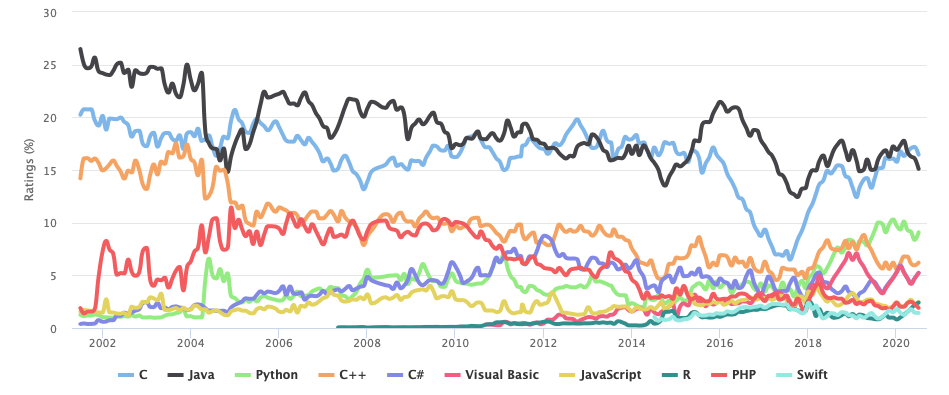
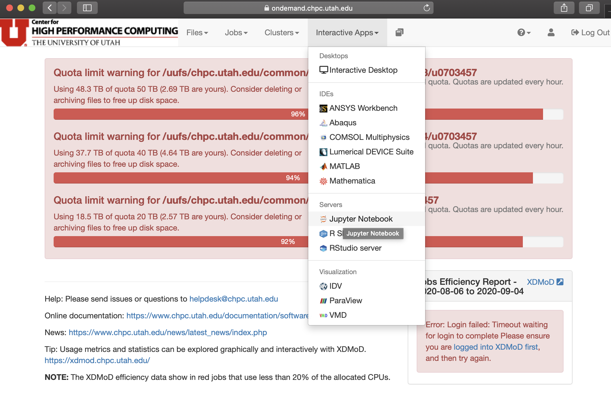
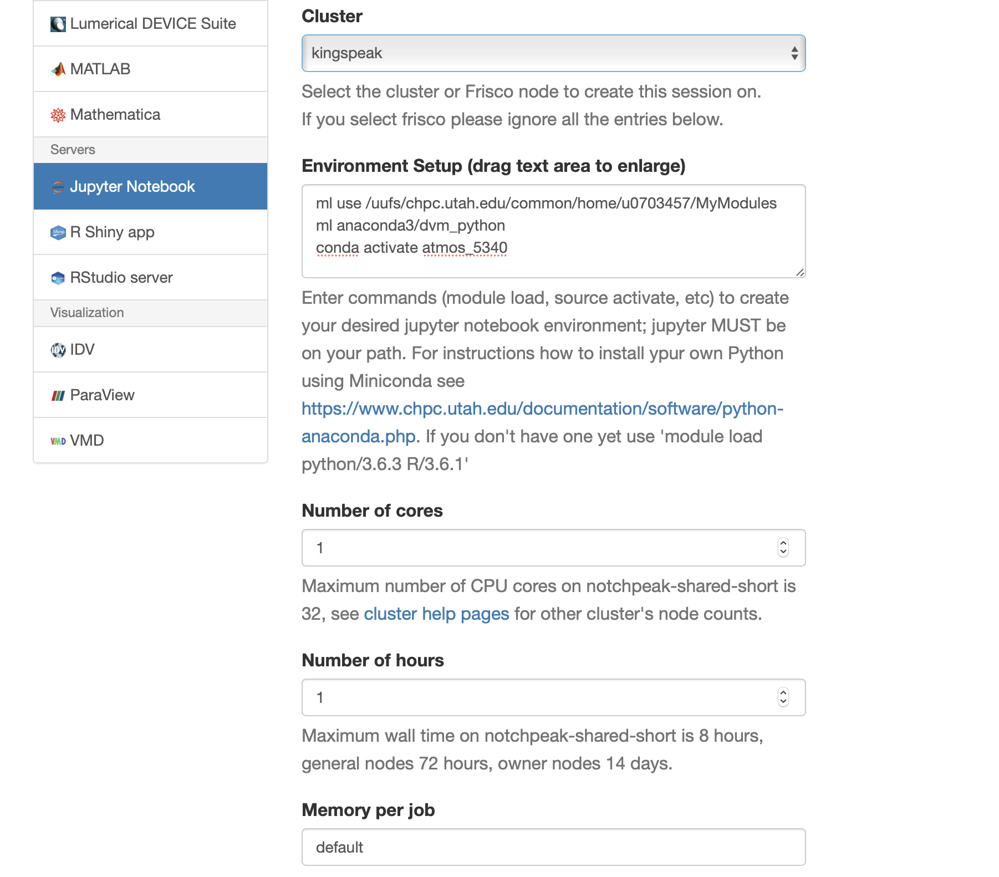

**Module 2** 
**ATMOS 5340: Environmental Programming and Statistics** 
**John Horel and Derek Mallia** 
Originally developed by Brian Baylock 
 

> # Announcement: 
> 1. Your programming quiz was due *Yesterday*.
> 1. The second programming quiz on 'Module 2' will be **due at the end of the week (Sunday)**.

> # Today's Objective
> Introduce Python and give you the building blocks to do more exciting things later.
>
> > Who has the textbook?
  

# Introduction to Python
## Chapter 1 from the Alex DeCaria textbook: 'Getting Started'

> ## From _The Zen of Python_, by Tim Peters  
>Beautiful is better than ugly.  
Explicit is better than implicit.  
Simple is better than complex.  
Complex is better than complicated.   
Readability counts.  
>
>>To read the full _Zen of Python_, type `import this` in a Python terminal.

Python is a popular general-purpose computer programming language invented by the Dutch programmer Guido van Rossum in 1990.

Python has grown into one of the top 3 most-popular programming languages, ranked by usage: https://www.tiobe.com/tiobe-index/.

 

It is heavily used by many companies including Google, Dropbox, Netflix, Spotify, Facebook, Goldman Sachs, etc. and, of course, in environmental science. There have been many tweets about Hurricane Dorian today. Many of the graphics appear to be made with Python. 
[Here](https://twitter.com/TropicalTidbits/status/1168162318422859777) |
[Here](https://twitter.com/JohnMoralesNBC6/status/1168242646600617984) |
[Here](https://twitter.com/RMS/status/1168633930930622467) |
[Here](https://twitter.com/mikarantane/status/1168794064675885056) |
[Here](https://twitter.com/JoshuaAlland/status/1168890718280212495) |
  
Some other examples of python maps that I've personally made can be found [here!](http://home.chpc.utah.edu/~u0703457/dereks_homepage/Atmos_5340/figures_made_in_python.pptx)
 
 
With a just a little bit of elbow grease you can make some really terrific plots using python! The plotting options in python are truely limitless.
 
 

## Stepping back for a second, why programming?
Learning a new language sounds really difficult! I am already a Microsoft Excel wiz kid, why can't I just use that for my number crunching?
- Data sets used in the Atmospheric Sciences are often very large
- A simple CSV file with weather station data can easily have millions of lines
- Numerical weather prediction data and other environmental data sets are often provided in compressed file formats not readable by Excel
- Even then, these data sets often contains a hundred million data points or more...
- Its difficult to automate processes with Excel and other spreadsheet applications!
- Ultimately, programming is quicker, *and easier* once you have become proficient with a specific language 
    - Learning your first langage is always the toughest part and learning subsequent languages is generally MUCH easier
- Programming is potentially a lifelong skill that will ultimately make you more employable depending on your career path

 
 

## Why use Python?
- Python software is **open source**, meaning that people can freely modify and share it.
- Python **syntax**, or the programing language's "grammar rules", is relatively intuitive compared to other languages. 
- Python Code can be easier to read due to formatting conventions. 
    - e.g., indented code blocks.
- Code is **interpreted** rather than **compiled**.  
    - Interpreted code runs slower, but is easier to write and debug.
- Python is relatively easy to learn. There is abundant documentation and learning material available online.
- Python is equiped to deal with almost all problems. While it does not necessarily excel at one thing in particular, its good at doing 'everything'
- More environmental science is being done in Python.
 - Python is object-oriented. Everything is an object. This makes coding very flexible but can also be confusing. We'll tend to use Python in a procedural-programming context that should minimize the confusion.

> ## A good read: [Why your first programming language doesn't really matter](https://www.techrepublic.com/article/why-your-first-programming-language-doesnt-really-matter/)

 
 

# Python 2 vs 3
Differences in coding are relatively minor but can create issues.
- Version 2.7 remains heavily used, but support for it is _rapidly_ being deprecated.
    - How much time is left? [Python 2.7 Retirement Count Down](https://pythonclock.org/)
    - Spoiler... Time is up!
- **Version 3.7**, or higher, is what you should be using.

Python 3.7 has already been installed for you! However, if you are feeling adventurous, you could install Python 3 on your own computer!
- For [Mac](https://docs.anaconda.com/anaconda/install/mac-os/) 
- For [PC](https://docs.anaconda.com/anaconda/install/windows/) 

> Note: When searching for online programming help, be aware of the two different versions and look for answers for Python 3.

 
 

A few more things about Python
- Python is dynamically typed
    - Variables generally do not need to be declared before using them (i.e real, string, integer)
- Python has a robust built-in set of data types, and users are free to define additional structures.
- Python is **case sensitive**.
    - Pressure, pressure, PRESSURE will be 3 completely different variables!
- Python is object oriented 
    - A programming paradigm based on the concept of "objects", which can contain data, in the form of fields (often known as attributes or properties), and code, in the form of procedures

  

  
---
---

# Terminology
You need to become familiar with terms used typically for all programming languages

| Term | Description | Example |
|--|--|--|
|Script|A file that contains one or more lines of Python code. Ends with the file exension `.py`.| `filename.py`
|Code| Program content 
|Package or Module or Library|Something you import that contains a collection of functions and methods that perform useful actions without writing the code yourself.|`import numpy`
|Statement| Instruction to a computer.| A line of code.
|Assignment| A statement that binds an expression (object) to a variable (name)| `=`
|Object| Anything that a variable can be referred to | a number, string, list, array, function, etc.
|Variable| Name of an assigned object. |
|Expression| Combo of numbers, text, variables, and operators that result in a new object when evaluated| `y = mx+b`
|Function| A block of statements used to create a new object
|Argument| A value passed to a function.| For the statement `max([1,9,5])`.  The object inside the `()` is the argument.
|Algorithm| Recipe for how to solve a problem
|Executable| File used to run a programs | `python`, `jupyter lab`
|Verification| Providing evidence that the program works correctly
|Debugging| Locating and correcting errors in a programs

[Reference: Python Glossary](https://docs.python.org/3/glossary.html)

  
# Interactive Python in the Classroom 
Log onto CHPC with **Open OnDemend**, and create a linux terminal session... 
 
On the command line, type the following commands, and pay attention to the output:

    which python

This command should tell you the location of the Python program `python`.

Now type:
    
    python

You are now in Python's built-in Interactive Development Environment (IDLE). You should see something like this:

    (base) atmoslab17:~ u0553130$ python
    Python 3.7.3 (default, Mar 27 2019, 16:54:48) 
    [Clang 4.0.1 (tags/RELEASE_401/final)] :: Anaconda, Inc. on darwin
    Type "help", "copyright", "credits" or "license" for more information.
    >>>

Press `enter` a few times. The bottom most `>>>` line, known as the prompt, is where you type code. Typing `enter` will run the code you type on that line.

## How to exit the IDLE
The next most important thing to know is how to exit Python. Exiting the IDLE depends on the version installed.
- `quit()`
- `exit()`
- `ctrl-d` or `ctrl-z`
- Type `quit` to see which ones apply.

Ok, now start Python back up in the terminal...
  
## Jupyter notebook

 
To log onto Jupyter notebook using CHPC's Open OnDemand, goto the following webpage: https://ondemand.chpc.utah.edu/
 
 
This website will require you to log in with your uID and password.
 
 
Next, goto the top bar on the webpage and click Interactive Apps which will a drop down menu. Select Jupyter Notebook on Notchpeak. Refer to the image to the right.
 
 
This will bring you to an online submission form that will allow you to pick your Python environment, number of compute cores, and the job submission account information. 

From the `cluster` drop down menu, select `Notchpeak`

For the Python Environment, add the following lines:  
    
    ml use /uufs/chpc.utah.edu/common/home/u0703457/MyModules
    ml anaconda3/dvm_python
    conda activate atmos_5340

 
 
An example of the Jupyter notebook form can be seen above

For `number of cores`, put 1. The jobs we will be running with Python are fairly simplistic and will not require much in terms of computational resources. For hours, select a value that is appriopriate for the amount of time that you plan on interactively playing with and running Python. 2 hours is probably long enough for now.

 

`Memory per job`, `Account`, `Partition`, and `GPU type:count` can be left to their default values. The default values should be set as: `1`, `notchpeak-shared-short`, `notchpeak-shared-short`, and `none`, respectively. If you change these accidently you will need to change this back as your settings are saved when submitting a new form. 

 

Once you are ready, click the launch button below, which will submit yout Jupyter notebook session to a que. It should take approximately 1-2 minutes for OnDemand to spin-up an interactive session. Once it is ready, it should similar to the image below. Once your job is ready, a 'Connect to Jupyter' icon should appear. Click this!

 

Once this session is activated, you should be able to play around with Python! Remembering how to setup a Python Jupyter notebook session will be critical to remember for the duration of this class, so make sure you understand how to assess/create a new session!

 

To create a Python Jupyter Notebook session, click the 'new' drop down menu in the upperight and select Python 3. This will create an interactive Jupyter notebook file, which can be saved at any point. An example of what the Python Jupyter Notebook session should look like can be seen below:

  
---
---

# Python Notebooks Environment
For the rest of the Python portion of the class, we will use _notebooks_ which allow for even more interactive exploration of Python programming.

A **notebook** is an interactive document containing code, output, graphics, and text (markdown). The standard suffix for a notebook is `.ipynb` short for "interactive Python notebook" (in case you were wondering). 

We will use the [Jupyter Lab](https://youtu.be/ctOM-Gza04Y) environment to simplify viewing notebooks, writing and running Python code, and accessing other Python tools.

> If you look at a notebook file using a text editor, it will look odd with a lot of formatting structure. That is because a notebook is written as a [JSON](https://www.json.org/) file. JSON documents contain text, source code, rich media output, and metadata. Each segment of the document is stored in a cell. More to follow on JSON later. Don't sweat this detail now.

## How to view Notebooks

1. **GitHub**: _View only_  
You have already used the [class GitHub repository](https://github.com/johnhorel/ATMOS_5020_2018) to view class notes saved as markdown files. GitHub will also render Jupyter Notebooks, like this one.
2. **nbviewer**: _View only_  
Sometimes the GitHub rendition does not always work for one reason or another, even after refreshing. If this happens, copy the notebook's URL and open it in the [**nbviewer**](https://nbviewer.jupyter.org/).
3. **Jupyter Lab**: _View, create, edit, and run_  
Jupyter Lab is the program we will use to create, open, view, and edit Python notebooks.

# Explore Jupyter Lab
Familiarize yourself with the various menus in Jupyter Lab.

- Find the file explorer on the left menu.
    - How do you navigate folders and files?
    - What is a terminal?
    - What is a console?
    - What is a notebook?

## Create a new notebook
From the Launcher tab, create a new Python3 Notebook.

**Rename the notebook `my_first.ipynb`** 
- _How do you do that?_

Type some python statements in a "cell."

- `a = 5`
- `b = 10`
- `print(a+b)`

Run the commands in the cell by selecting the "play" button ▶ at the top or `shift+enter`.

> The `[*]` next to the cell indicates the cell is running. A number, `[1]`, indicates the cell was run and has finished. The number indicates the order the cells were run.

## How do you...
- edit a cell?
- insert a new cell?
- select a cell?
- run code in a cell?
- run all cells?
- change a cell from "code" to "markdown", and vice versa?

> What does 'restart the kernel' do?

> **Keyboard Shortcuts**: The keys `Shift+Enter` will run the selected cell.
>
> Reference: [Jupyter Shortcuts](https://github.com/johnhorel/ATMOS_5020_2018/blob/master/supplemental_docs/jupyter_shortcuts.md)  
> Reference: [Jupyter Notebook Documentation](https://jupyter-notebook-beginner-guide.readthedocs.io/en/latest/what_is_jupyter.html)

## Other functions
- Right click a cell to see what you can do with it.
    - Cut, copy, paste, split, merge, delete etc.
- Hover mouse over top tool bar icons to see what they do.
    - The kernel is where Python runs. If the kernel gets stuck running bad code, you might need to stop/restart the kernel.
- Create a second notebook and put it side-by-side the other notebook
    - Click and drag the tab to move the window next to the other tab.  
  
---
---

> # Want more practice!
> Try this tutorial...https://www.tutorialspoint.com/python3/index.htm.  
>
> Or try the [Codecademy Python course](https://www.codecademy.com/learn/learn-python). The course for version 2 is free . The version 3 course requires a subscription, but that isn't necessary since python 2 and 3 are so similar. Just be aware of the difference: 
>
> 
>
> Another resource: https://www.datacamp.com/courses/intro-to-python-for-data-science
